# LECTURE 1

## Definition of the Plant breeding:

Plant breeding as a human endeavor **(çaba, uğraş, gayret)** has its origins in antiquity, starting off simply as discrimination among plant types to select and retain plants with the most desirable features. 

**<u> NOTE </u>** Plant breeding can broadly be defined as the improvement of the genetic patterns of domestic plant populations. Based on the importance of plants for human life, humans have been involved in manipulating and improving plants for their needs for more than 11 000 years.

## Aim of Plant Breeding:

+ Plant breeders have mainly been concerned with bringing about a continuous improvement in the productivity of that part of the plant which is of economic importance, the stability of production through in-built resistance to pests and diseases and nutritive and organoleptic or other desired quality characters.

+ Plants breeding aims to improve the characteristics of plants so that they become more desirable agronomically (tarımsal açıdan) and economically. 

**<u> NOTE </u>** In summary the aim of plant breeding is to produce disease-free, high-yielding, and early-maturing varieties of crops.

## Objective of plant breeding: 

+ **High primary productivity and efficient final production for each unit of cultivation and solar energy invested:** to ensure that all the light that falls on a fields is intercepted by lraves and that photosynthesis itself is as efficient as possible.

  + Greater efficiency in photosynthesis could perhaps be achieved by reducing photorespiration. 

+ **High crop yield:** Plants must be selected which invest a large proportion of their total primary productivity into those areas which are commercially desirable, e.g. seeds, roots,leaves or stems, grain (tahıl, granül), fodder, fibre,tuber, cane or oil depending upon the crop species. 

+ **Desirable nutritional value, organoleptic properties and processing qualities:** the proportion of essential amino acids and the total protein in cereal grains, for example, should be increased to improve their nutritional quality. 

+ **Biofortifying crops:** with essential mineral elements that are frequently lacking in the human diet such as Fe and Zn, vitamins and amino acids. 

+ **Modifying crop plants to generate plant derived pharmaceuticals** to supply low-cos grugs and vaccines to the developing world. 

+ **More extensive and efficient nitrogen fixation:** breeding cereals that encourage (teşvik etmek) the growth of increased numbers of nutrogen fixing microorganisms around their roots to reduce the need for nitrogen fertilizer. 

+ **More efficient use of water:** whether there is a plentiful supply or dearth of water.

+ **Insensitivity to photoperiod and temperature:** selection of the crop cultivars that are insensitive to photoperiod of temperature and characterized by a high per-day biomass production would allow the development of contingency cropping patterns to suit different weather probabilities. 

+ **Plant arcitecture and adaptability to mechanized farming:** The number and positioning of the leaves, branching pattern of the stem, the height of the plant, and the positioning of the organs to be harvested are all important to crop production and often determine how well plants can be harvested mechanically. 
+ **Elimination of toxic compounds:** it is essential to develop varieties free from toxic compounds in some crops to make them safe for human consumption. 

+ **The following items are also included in this topic:**

```markdown
= Biomass and renewable energy
= imporoved quality
= Abiotic and Biotic resistance
= Dormancy 
= Desirable Agronomic Characteristics
= Synchronous Maturity
= Change in maturity Duration.
```

<p align="center">  </p>

## Undesirable Effects

+ **Reduction in Diversity:** Modern improved varieties are more uniform than land races. Thus plant breeding leads to reduction in diversity. The uniform varieties are more prone to the new races of pathogen than land races which have high genetic diversity. 

+ **Narrow genetic base:** Uniform varieties have narrow genetic base. such varieties generally have poor adapability. 

+ **Danger of Uniformity:** Most of the improved varieties have some common parents in the pedigree which may cause danger of uniformity. 

+ **Undesirable Combinaitons:** Sometimes, plant breedings leads to undesirable combinaitons. The examples of man made crops having undesirable combinaiton of characters are *Raphanobrassice* and *Pomato*. 

## Molecular Plant Breeding

+ Plant breeders will be equipped with innovative approaches;

  + to identify/or create genetic variaiton,
  + to define the genetic feature of the genes related to the variations (position,function and relationship with other genes and environments), 
  + to understand the structure of breeding populations, 
  + to recombine novel alleles or allele combinaitons into specific cultivars or hybrids, 
  + to select the best individuals with desirable genetic features which enable them to adapt to a wide range of environments. 

+ DNA chips and other technologies are being developed to study the expression of multiple or even all genes simultaneously. 

+ With the advent of DN-based molecular markers, the extensive genetic mapping od chromosome become readily possible for a variety of species.

+ Several mechanisms for the de novo variation have been described, including intragenic recombianiton, unequal crossing over among repeated elements, transposon activity, DN Amethylation, and paramutation.

+ Another important feature in plant breeding whose molecular basis is not understood is `heterosis` although it is used as the basis for many seed-producing industries. 

+ `Genomics` and prticularly `transcriptomics` are now being used to identify the heterotic genes responsible for increasing crop yields (microarray and real time PCR)

+ **Genetic modification of crops** today involves the interfacing of molecular biology, cell and tissue culture, and genetics/breeding

  + The transfer of genes by cellular and molecular means will increase the available gene pool and lead to second generation biotechnology plant products such as those with a modified oil, protein, vitamin, or micronutrient content or those that have been engineered to produce compounds that can be used as vaccines or anticarcinogens. 

<p align="center">

</p>

## Duration and cost of plant breeding programs

+ It is estimated that i takes about 7-10 years (or even longer) to complete a breeding program for annual cultivars as corn, wheat, and soybeans, and much longer for tree crops. 

+ The use of molecular techniques to facilitate the section process may reduce the time for plant breeding in some cases. 

+ Genetically engineered parental stock attracts a steep fee to use beacuse of the costs involved in their creation. 

## Selected milenstones in plant breeding

+ **9000 BC:** First evidence of plant domestication in the hills above the tigris river

+ **3000 BC:** Domestication of all important food crops in the old world completed. 

+ **1000 BC:** Domesticaiton of all important food crops in the New World completed. 

+ **700 BC:** Assyrians and Babyloninas hand pollinate date palms.

+ **1719:** Fairchild created first artifical hybrid (carnationx sweet william)

+ **1934:** Dustin discovered `colchicines`

+ **1950:** McClintock discovered the Ac-Ds system of transposable elements. 

+ **1972:** Berg, Cohen, and boyer introduced the `recombinant DNA` technology. 

+ **1994:** `"FlavrSavr" tomato` developed as `first genetically modified food` produced for the market.

+ **1995:** Bt corn developed. 

<u> <p style="color:gold;">NOTE:</p> 

Bt corn is enhanced through biotechnology to protect against insect pests. Its built-in insect protection comes from a naturally occurring microorganism called Bacillus thuringiensis or “Bt.” The protein produced by Bt corn selectively targets caterpillars within the order of Lepidoptera. </u>

+ **1996-1997:** `Roundup Ready` soybean and wheat introduced

## Early Efforts at plant breeding

+ __Selective breeding;__ has been employed by early farmers to re-engineer plants to produce traits or qualities that were considered to be desirable to consumers. 
  + the best plants to provide seed for their next crop

  + Fİnd prolific or disease resisted plant and capture these desirable traits by corresponding them into other plants. 

+ __Domestication;__ modern plant breeding started with sedentary agriculture and the of domesticaiton the first agricultural plants, cereals.

+ __Artifical crosses;__ besides selecting plants with useful characteristic s breeders also arrange 'marriages' between plants with different traits in the hope of producing fertile offspring carrying both traits. 

+ __Hybridization;__ to be the important sources of new cultivars and stressed crossing of carefully selected parents to meet the aims of new cultivars. 

<p align="center">
 
</p>

## Doemsticaiton of the plant breeding

+ The process of bringing a wild species under human management is referred to as `domenstication`

  + The earliest records indicate that agriculture developed some 11,000 ears ago in the so-called *Fertile Crescent*.

+ Domesticaiton is a selection process carried out by man to adapt plants and animals to their own needs, wheteher as farmers or consumers. 

+ <u> Domestication is directed evolution; as a result, the process of evolution is accelerated. </u>

+ The key to domesticaiton is the selective advantage of rare mutant alleles
 which are desirable for saccesful cultivaiton but unnecessary for survival in the wild. 

<p align="center">

</p>

### Steps in the domestication process

+ Man not only planted seeds, but also:

  + `moved seeds from their native habitat` and planted them in areas to which the were perhaps not as well adapted. 

  + `Removed certain natural selection pressures by growing the plants` in a cultivated field. 

  + `applied artifical selection pressures` by choosing characteristics that would not necessarily have been benefical for the palnts under natural conditions. 

## Genetic engineering and gene transfer

+ The discovery of the structure of DNA has enhanced traditional breeding techniques by allowing breeders to pinpoint the particular gene responsible for a particular trait and to follow its transmission to subsequent generations. 

+ Enzymes that cut and rejoin DNA molecules allow scientists to manipulate genes in the laboratory. 

+ The goal of plant genetic engineers is to isolate one or more specific genes and introduce these into plants. 

+ DNA can also be introduced into cells by bombardment with DNA-coated particles or by `electroporation`.


<p align="center">
 
</p>

## DNa markers and genomics

+ During the 1980s and 1990s, various types of molecular markers such as `restriction fragment length polymorphism (RFLP)`, `Randomly amplified polymorphic DNA (RAPD)`, `microsatellites` and `Single nucleotide polymorphism (SNP)` were developed. 

+ Becuase of their abundance and importance in the plant genome, molecular markers have been widely used in the fields of germplasm evaluation, genetic mapping, map-based gene discovery and marker-assisted palnt breeding

+ Technological developments in bioinformatics, genomics and various omics fields are creating substantial data on which future revolutions in plant breeding can be based

## Base of plant breeding

+ Darwin's theory of evolution through natural selection can be summed up in three principles that are at the core of plant breeding. These are the principles of:

  + **`variation`:** Variation in morphology, physiology, and behavior exist among individals in a natural population. 

    + There are various sources of genetic variation:

      + crossover, genetic drift and gene flow
      + Mutation (loss, addition, duplicaiton or rearrangement of whole chromosomes or chromosome segments)

  + **`Heredity`:** Offspring resemble their parents more than they resemble unrelated individuals.

  + **`Selection`:** Some individuals in a group are more capable of surviving and reproducing than others. 

<u> <p style="color: orange;">Recall</p>

<p style="color:yellow;">Genetic drift</p> is an evolutionary change in allelic frequencies of a population as a matter of chance. It occurs in very small populations, but its effects are strong. It occurs due to an error in selecting the alleles for the next generation from the gene pool of the current generation. It does not occur due to any environmental influences.

In large populations, the allele frequency of the genes remains relatively stable because the genes are not affecting fitness and do not have a natural selection pressure against the alleles. 

<p style="color:yellow;">The gene flow</p> is a popular and individual genetic material which transfers from one population to another. This involves different types of events such as pollen being driven to an entirely new destination or people migrating to a new place. If the versions of gene flow are carried to a population where the gene versions do not exist, it can be a major source of genetic variation. In the above image, the version of brown colouration shifts from one population to another.

Migration from one popular place to another is also responsible for a change in allele frequencies which covers a proportion of members to carry a particular variant of a gene. This immigration can also result in the addition of genetic variants to the established gene supply of one particular population. </u>

## Principles of breeding

+ **Inbreeding:** main goals of the inbreeding;

  + Increase the homozygosity at all or specific loci in the plant genome

  + produce a plant which breeds true

  + produce uniform plants

+ **Hybridization:** Hybridization occurs when inbreed parents are mated (cross pollinated)

  + creates heterozygous individual

  + increased heterosis (vigor) in F1 generation. 

<p align="center"> 

</p>

+ **Heterois (hybrid Vigor)** Heterosis occurs when two homozygous individuals are cross pollinated
  + This causes all loci to become heterozygous
  
  + The increased heterozygosity causes increased plant vigor

  + Benefits of Increased Vigor
  
    + Increased yield
    
    + Better standability
    
    + Better germination
    
    + Overall better plant performance

  <p align="center">
  
  </p>

# LECTURE 2

## Mendelian Genetics

+ Mendel developed two important laws of genetics

  + Law of segregation 

  + Law of independent assortment

### Law of Segregation

The Principle of Segregation describes `how pairs of gene variants are separated into reproductive cells.` The segregation of gene variants, called alleles, and their corresponding traits was first observed by Gregor Mendel in 1865. Mendel was studying genetics by performing mating crosses in pea plants. He crossed two heterozygous pea plants, which means that each plant had two different alleles at a particular genetic position. He discovered that the traits in the offspring of his crosses did not always match the traits in the parental plants. This meant that the pair of alleles encoding the traits in each parental plant had separated or segregated from one another during the formation of the reproductive cells. From his data, Mendel formulated the Principle of Segregation. We now know that the segregation of genes occurs during meiosis in eukaryotes, which is a process that produces reproductive cells called gametes. `(This text is taken from [nature](https://www.nature.com/scitable/definition/principle-of-segregation-301/) page.)`

<p align="center">

</p>


### Law of Independent Assortment

The Principle of Independent Assortment describes how different genes independently separate from one another when reproductive cells develop. 

We now know that this independent assortment of genes occurs during meiosis in eukaryotes. During meiosis, the pairs of homologous chromosome are divided in half to form haploid cells, and this separation, or assortment, of homologous chromosomes is random. This means that all of the maternal chromosomes will not be separated into one cell, while the all paternal chromosomes are separated into another. Instead, after meiosis occurs, each haploid cell contains a mixture of genes from the organism's mother and father.

Another feature of of independent assortment is recombination. Recombination occurs during meiosis and is a process that breaks and recombines pieces of DNA to produce new combinations of genes. Recombination scrambles pieces of maternal and paternal genes, which ensures that genes assort independently from one another. It is important to note that there is an exception to the law of independent assortment for genes that are located very close to one another on the same chromosome because of genetic linkage `(This text is taken from [nature](https://www.nature.com/scitable/definition/principle-of-independent-assortment-302/) page.)`

<p align="center">

</p>

+ Consider the dihybrid cross between YyRr heterozygotes

+ For a monohybrid cross Yy plants, we can use a simple `punnet square` to determine that the probabilities of the offspring genotypes are 1/4 for YY, 1/2 for Yy, and 1/4 for yy.

+ the same probabilities apply to the offspring genotypes for seed shape: 1/4 RR, 1/2 Rr, and 1/4 rr.

+ We can simply use the multiplication rule to determine the probability of each of the genotypes in the F2 generation. 

+ The calculations for finding the probabilities of two of the possible F2 genotypes (YYRR and YyRR) are shown below 

```markdown
Probability of YYRR= 1/4 (probability of YY) x 1/4 (RR)= 1/16
```

```markdown
Probability of YyRR= 1/2 (Yy) x 1/4 (RR)= 1/8
```

+ A trihybrid with purple flowers and yellow, row seeds (heterozygous for all three genes) with a plant with purple flowers and green, wrinkled seeds (heterozygous for flower color but homozygous recessive for the other two characters)

+ Using Mendelian symbols, our cross is PpYyRr Ppyyrr.

+ Listing all genotypes we could get that fulfill this condition: ppyyRr, ppYyrr, Ppyyrr, PPyyrr, and ppyyrr


## Basic Plant Genetic

In eukaryotes, the DNA of the genome typically contains large fraction that does not carry genes


<u> A TYPİCAL EUKARYOTİC GENE </u>


***<u><p style="color:yellow;">EUKARYOTİC TRANSCRİPTİON GENE REGULATİON</p></u>***

<p style="color:green;">
Like prokaryotic cells, the transcription of genes in eukaryotes requires the action of an RNA polymerase to bind to a DNA sequence upstream of a gene in order to initiate transcription. However, unlike prokaryotic cells, the eukaryotic RNA polymerase requires other proteins, or transcription factors, to facilitate transcription initiation. RNA polymerase by itself cannot initiate transcription in eukaryotic cells. </p>

***<u><p style="color:brown;">Promoter and the Transcription Machinery</p></u>***

<p style="color:green;">
Genes are organized to make the control of gene expression easier. The promoter region is immediately upstream of the coding sequence. This region can be short (only a few nucleotides in length) or quite long (hundreds of nucleotides long). The longer the promoter, the more available space for proteins to bind. This also adds more control to the transcription process. The length of the promoter is gene-specific and can differ dramatically between genes. Consequently, the level of control of gene expression can also differ quite dramatically between genes. The purpose of the promoter is to bind transcription factors that control the initiation of transcription. 
</p>

<p style="color:green;">
Within the core promoter region, 25 to 35 bases upstream of the transcriptional start site, resides the TATA box. The TATA box has the consensus sequence of 5’-TATAAA-3’. The TATA box is the binding site for a protein complex called TFIID, which contains a TATA-binding protein. Binding of TFIID recruits other transcription factors, including TFIIB, TFIIE, TFIIF, and TFIIH. Some of these transcription factors help to bind the RNA polymerase to the promoter, and others help to activate the transcription initiation complex. 
</p>

<p style="color:orange;">
In some eukaryotic genes, there are regions that help increase or enhance transcription. These regions, called enhancers, are not necessarily close to the genes they enhance. They can be located upstream of a gene, within the coding region of the gene, downstream of a gene, or may be thousands of nucleotides away.
Enhancer regions are binding sequences, or sites, for specific transcription factors. When a protein transcription factor binds to its enhancer sequence, the shape of the protein changes, allowing it to interact with proteins at the promoter site. However, since the enhancer region may be distant from the promoter, the DNA must bend to allow the proteins at the two sites to come into contact. DNA bending proteins help to bend the DNA and bring the enhancer and promoter regions together.
</p>

<p align="center">


<u> A TYPİCAL EUKARYOTİC MATURE mRNA </u>


`Allele` is one of a number of alternative forms of the same gene or same genetic locus.

`Locus` is the specific location of a gene or DNA sequence od position on a chromosome

## Inheritance Patterns are Often More Complex Than Predicted by Simple Mendelian Genetics

+ Many heritable characters are not determined by only one gnee with two alleles

+ Most genes have multiple phenotypic effects, a property called `pleiotropy`.

+ However the basic principles of segregation and independent assortment apply even to more complex patterns of inheritance

## Dominance/ Recessiveness/ Codominant/ Complete Dominance/ Incomplete Dominance

There are two alleles for any given gene; dominant and recessive 

+ `Dominance` is a relationship between alleles; one allele can be dominant over a second allele, recessive to a third alelle, and codominant to a fourth (dominance differs from epistasis)

+ `Co-dominance` occurs when the contributions of both alelles are visible in the phenotype

  + For example in co-dominance, a red homozygous flower will produce offspring that have red and white spots. 

+ `Complete Dominmance` is the effect of one allele in a heterozygous genotype completely masks the effects of the other. 

+ `Incomplete and Semi-dominance` occurs when the phenotype of the heterozygous genotype is distinct from and often intermediate to the phenotypes of the homozygous genotypes. 

<p align="center">

</p>

## The Relation Between Dominance and Phenotype

+ a dominant allele does not subdue a recessive alelle; alleles do not interact that way

+ Alleles are simply variations in a gene's nucleotide sequence 

+ For any character, dominance/recessivenes relationshio of alelles depend on the level at which we examine the phenotype

+ Supposed that a dysfunctional enzyme causes an accumualtion of lipids

  + at the organismal level, the alelle is recessive

  + At the biochemical level, the phenotype is incompletely dominant

  + At the molecular level, the alelles are codominant

## Epistasis

Some traits may be determined by two or more genes

+ In epistasis, a gene at one locus alters the phenotypic expression of a gene at a second locus

+ Absence of expected phenotype as a result of masking expression of one gene pair by the expression of another gene pair

  + The `homozygous recessive conditions` masks the effect of a `dominant allele at another locus`

  + Crossing sweet pea plants produces purple; F2 generation hs a 9:7 rather than 9:3:3:1 dihybrid ratio; explained by `homozygous recessive blocking production of a metabolic enzyme`

  + Albino animals inherit allelic pair (aa) preventing production of melanin, expression of eye, hair,color.

  <p align="center">
   
  </p>

## Polyploidy

+ Arise by failure mitosis or meiois

+ Polyploid human zygotes are not viable

+ `Many polyploids are infertile, depending on the number of chromosome sets they have inherited. If the individual has inherited an odd number of chromosome sets (3n, 5n, etc), they are usually infertile. This is because the chromosomes cannot pair up correctly during meiosis and thus mo functional gametes are produced. If the individual has an even number of chromosome sets, they are usually fertile. This is because the chromosomes can still pair up during meiosis and produce functional gametes.`

+ `This explains why most naturaslly occuring polyploids have an even number of chromosome sets. It also explains why most organisms with an odd number of chromosomes are palnts. This is because plants can undergo vegetative growth, resulting in numerous individuals without producing gametes or the need for meiosis.`

+ ***`Polyploid:`*** having more complete sets of cromosomes than an ancestor triploid (3n), tetraploid (4n), hexaploid (6n), octaploid (8n)

+ ***`Euploid:`*** having the normal number of complete sets of chromosomes for plants and animals, usually 2 sets (diploid, 2n); for gametes, 1 set (haploid, n).

+ ***`ANeuploid:`*** having an incomplete or overcomplete sets of chromosomes.

  + ***Nullisomy:*** entire homologous pair is missing 

  + ***Monosomy:*** One homolog; partner is missing (2n-1)

  + ***Polysomy:*** More than two homologs

    + Trisomy (2n+1)

    + Tetrasomy

    + Pentsomy

### Polyploid can Arise by an Error in Mitosis

+ Through the applicaiton of appropriate chemicals and other suitable environmental conditions, plant cells can be made to proliferate into an amorphous mass called `callus`

+ `Callus is an undifferentatied mass of cells` (cells with no assigned functions); it is a material used in genetic engineering to receive and incorporate foreign DNA into cells. 


## Mitotic Failure is Often induced with colchicine

+ The nuclear division process may be disrupted (e.g., Using a chemical called colchicine) on purpose by scientist, by interfering with the `spindle fibers` (the structures that pull the chromosome to opposite poles of the cell)

+ The consequence of this action is that the chromosomes fail to seperate properly into the daughter cells. 

+ A mitotic product may contain a duplication of all or some of the original set of chromosomes

<p align="center">

</p>

+ Tetraploidization can restore fertility to an infertile diploid hybrid plants. 


### Triploidy can arise by an error in meiosis 1

During meiosis I, homologous chromosomes fail to separate properly, leading to the formation of gametes with an extra set of chromosomes. When such gametes are fertilized by a normal gamete, a triploid zygote is formed.


### Triploidy can arise by an error in meiosis 2

Meiosis II involves the separation of sister chromatids, and errors during this stage generally result in a gain or loss of individual chromosomes (aneuploidy), rather than a complete extra set of chromosomes (triploidy).


### Triploidy can arise by double fertilization

Triploidy typically arises from the fusion of two sperm with one egg (dispermy) or from the fertilization of an egg by a diploid sperm (haploid-diploid). Both scenarios involve fertilization errors during reproduction rather than the normal process of double fertilization, which involves one sperm fertilizing one egg to form a diploid zygote in plants. Double fertilization is a unique process found in flowering plants where one sperm fertilizes the egg to form the zygote, and the other sperm fertilizes the central cell to form the endosperm, which provides nourishment to the developing embryo. Triploidy resulting from double fertilization is not a typical occurrence in biological systems.


### Triploidy can arise by mating of a tetraploid to a diploid

Triploidy can indeed arise through the mating of a tetraploid individual (with four sets of chromosomes) with a diploid individual (with two sets of chromosomes). When gametes from the tetraploid combine with gametes from the diploid during fertilization, the resulting zygote may inherit an extra set of chromosomes, resulting in triploidy.

This scenario is an example of a form of polyploidy, where an organism has more than two complete sets of chromosomes. Triploidy, in this case, arises from the combination of gametes from individuals with different ploidy levels.


### In triploid meiosis chromosomes are unpaired or mispaired

In triploid individuals, during meiosis, chromosomes may indeed experience pairing abnormalities. This can occur because there is an uneven number of chromosomes, making it impossible for all chromosomes to pair properly in sets of two, as occurs in normal diploid meiosis.

Because there are three sets of chromosomes in triploid individuals, there might be difficulty in forming proper chromosome pairs during prophase I of meiosis. Chromosomes may either remain unpaired, leading to univalents, or they may mispair with chromosomes from different sets, forming trivalents. These pairing abnormalities can result in errors during segregation, leading to gametes with unbalanced chromosome numbers.

The irregularities in chromosome pairing and segregation during meiosis in triploid individuals can contribute to reduced fertility and various developmental abnormalities in the resulting offspring.

## Autopolyploidy

+ Autopolyploidy results from a failure of the chromosomes to seperate during meiosis. However, unlike aneuploidy, not just a single pair of chromosomes failure to seperate, all of them fail to seperate. This total non-disjunction of all chromosomes results in gametes carrying two sets of chromosomes (2n) 

+ When one of the resulting gametes (2n) combines with a regular haploid (n) gamete, the resulting offspring are triploid (3n).

+ Offspring produced in this way are normally infertile because they have an uneven number of chromosomes that won't pair correctly during meiosis. 


+ When two of these gametes (2n) combine, the resulting offspring are tetraploid (4n). This is common in plants as they produce both male and female gametes and are often capable of self-fertilisation. 

+ The resulting offspring a generally fertile as they have an number of chromosomes. If the new tetraploid offspring cannot reproduce with the parental type (diploid) plants, but can repdoduce with each other, a new species has been fromed. 

<p align="center">

</p>

## Allopolyploidy

+ Allopolyploidy occurs when two closely related species mate and produce a hybrid containing chromosome sets from both parent species. 

+ The resulting hybrid is usually sterile because the chromosomes from each species cannot pair correctly during meiosis. The two different species involved may also contribute different numbers of chromosomes which again prevents chromosome pairing during meiosis, rendering the hybrid sterile. 

<p align="center">

</p>

## Amphipolyploidy

+ Doubling the chromosome number in a sterile hybrid can often produce a fertile hybrid. This process is known as amphipolyploidy.

+ Allopolyploidy generally produces infertile hybrids because the chromosomes from each of the parent species cannot pair correctly. In this example, you can almost think of the resulting hybrid as being haploid (n) with 5 individual chromosomes rather than any chromosome pairs. However, autopolyploidy can double the chromosome number, producing a fertile hybrids with two of each chromosome.

+ If these new fertile hybrids cannot reproduce with the parental types, but can reproduce with each other, a new species has been formed. 

<p align="center">

</p>

<p align="center">

</p>

## Evolutionary significance

+ Polyploidy can cause speciation (the formation of new species)

+ It has played an important role in the evolution of many species, especially plant crops. 

## The evolution of wheat

Each hybridisation was followed by chromosome doubling in the new hybrid; this enables normal bivalent formation at meiosis and thus the production of fertile plants. The initial hybridisation, that occurred approximately 10,000 years ago, is believed to have been between the two grass species T. urartu (the A genome donor), and T. speltoides (the B genome donor). This new species would have been tetraploid (four complete genome complements) Hexaploid wheat arose as a result of a second hybridisation between the new tetraploid and a third diploid species, T. tauschii (the D genome donor). Again, chromosome doubling must have occurred in order to produce a fertile individual. This new species would then have have 42 chromosomes; that is, six complete genomes each of 7 chromosomes (This information is taken from [cerealsdb.uk.net](https://www.cerealsdb.uk.net/cerealgenomics/WheatBP/Documents/DOC_Evolution.php) page.)

<p align="center">

</p>

## Qualitative and quantitative traits

+ `Qualitative traits` are genetically controlled by one or a few major genes, each of which has a relatively large effect on the phenotype but is relatively insensitive to environmental influences.

  + Trait distribution in a typical segregating population such as an F2 shows multi-peak distribution, although individuals within a category show continuous variation
  
  + Each individual in the population can be classified unambiguously into distinct categories that correspond to different genotypes so that they can be studied using Mendelian methods

+ Quantitative traits are genetically controlled by many genes, each of which has a relatively small effect on the phenotype, but is largely influenced by environmental factors

  + Trait distribution in an F2 population usually shows a normal or bell-shape distribution and as a result, individuals cannot be classified into phenotypic categories that correspond to different genotypes thus making the effects of individual genes indistinguishable

  + Quantitative genetics is traditionally described as the study of all these genes as a whole and the total variation observed in a population results from the combined effects of genetic (polygenes as a whole) and environmental factors
  
  + However, quantitative variation is not due solely to minor allelic variation in structural genes as regulatory genes no doubt also contribute to this variation
  
  + We expected polygenes to show allthe typical properties of chromosomal genes both in terms of action and in transmission through meiosis

## Polygenic Inheritance

+ Quantitative characters are those that vary in the population along a continuum

+ Quantitative variation usually indicates polygenic inheritance, an additive effect of two or more 
genes on a single phenotype

+ Grain colour in wheat where each gene promotes pigment
production is an example of polygenic inheritance

+ The effects of each gene are small where uppercase and lowercase letters did not imply dominance or recessiveness but rather the additive effects of each allele

<p align="center">
 
</p>

## Genetic Variation

+ The creation of new alelles and the mixing of alelles through recombinaiton give rise to `genetic variation` which is on eof the forces behind evolution.

+ Natural selection favours one phenotype over another and these phenotypes are conditioned by one or more alelles.

+ `Genetic variation is fundamental for selection, by which progress in plant breeding can be made`

+ There are various sources of genetic variation:

  + Crossover, genetic drift and gene flow

  + Mutation

## Mutation

+ A mutation is any change in the sequence of the DNA encoding a gene which leads to a change in the hereditary material when an organism undergoes DNA replication

+ During the process of replication, the nucleotides of a chromosome are altered, so rather than creating an identical copy of DNA strands, there are chemical variations in the replicated strands

+ The alteration on the chemical composition of DNA triggers a chain reaction in the genetic information of an individual

+ The effect of a mutation depends on its size, location (intron or exon etc.), and the type of cell in which the mutation occurs

+ Large changes involve the loss, addition, duplication or rearrangement of whole chromosomes or chromosome segments

+ Most DNA polymerases have the ability to proofread their work to ensure that the unaltered genetic material is transferred to the next generation

### Mutation Types

+ `Point Mutation:` represent the smallest changes where only a single base is altered

  + For example, a snigle nucleotide change may result in the change of an amino acid (aa) codon into a stop codon and thus produce a change in the phenotype. 

  + Point mutation do not usually benefit the organism as `most occur in recessive genes` and are not usually expressed unless two mutations occur at the same locus

+ `Synonymous or silent substitutions:` The sea sequence of the protein is not changed because several codons can code for the same aa, and in non-synonymous substitutions changes in the aa sequenc may not affect the function of the protein.

+ `Loss-of-function mutations:` Wild type alelles typically encode a product necessary for a specific biological function and if a mutation occurs in that alelle, the function for which it encodes is also lost. 

  + They are typically recessive

  + The degree to which the function is lost can vary

    + If the function is entirely lost, the mutation is called a `null mutation`

    + It is also possible that some function may remain, but not at the level of the wild-type alelle, these are known as `leaky muatations`

+ `Gain-of-function mutations:` 
a small number of mutations are actually benefical to an organism providing new or improved gene activity.

  + In these cases, the mutation creates a new alelle that is associated with a new function.

  + Any heterozygote containing the new alelle along with the original wild-type alelle will express the new alelle.

  + Genetically this will define the mutation as a dominant

+ `Substitution:` is a mutation in which one base is exchanged for another. Such a substitution could change:

  + a codon to one that encodes a different aa thus causing a small change in the protein produced
  
  + a codon to one that encodes the same aa resulting in no change in the protein produced
  
  + an aa-coding codon to a single ‘stop’ codon resulting in an incomplete protein

+ `Insertions/deletions (indels):` produce changes by deleting or inserting sections of DNA into the ‘parental’ DNA sequence

  + Because it is usually impossible to say whether a sequence has been deleted from one plant or inserted into another, these differences are called indels
  
  + Obviously the deletion of part of a gene can seriously affect the phenotype of organisms
  
  + Insertions can be disruptive if they insert themselves into the middle of genes or regulatory regions

<p align="center">

</p>

`Frame-shift mutation:` A mutation in which one nucleotide is changed causing all the codons to its right to be altered

  + Since protein-coding DNA is divided into codons of three bases long, insertions and deletions of a single base can alter a gene so that its message is no longer correctly parsed
  
  + As a result, a single base change can have a dramatic effect on a polypeptide sequence

<p align="center">

</p>

+ `Germinal mutations:` Mutations which occur in germ line cells including both the gametes and the cells from which they are formed

  + A single germ line mutation can have a range of effects:
  
    + no phenotypic change; mutations in junk DNA are passed on to the offspring but have no obvious effect on the phenotype; 
    
    + small (or quantitative) phenotypic changes
    >
    + significant phenotypic change

+ `Somatic mutation:` Mutations in somatic cells which give rise to all non-germ line tissues, only affect the original individual and cannot be passed on to the progeny.

<p align="center">

</p>

# LECTURE 3

## Plant Reproductive System

### Plant Reproduction

+ **Reproduction** is the process by which plants multiply themselves

+ The mode of reproduction determines the `method of breeding` the species and `how the product of breeding is miantained for product identity preservation`

+ In the past plant breeding methods were farily distinct for `self-pollinated species` and for `cros-pollinated species`, such a clear distinction does not currently exist.

<p align="center">

</p>

### Types of Reproduction:

+ plants are generally classified into two groups based on mode of reproduction as either *sexually reproducin* or *asexsually reproduction* 

  + ***sexual reproduction***
    
    + Seedlings produced after ***sexual union (fertilizaiton**) involving the fusion of sex cells or gametes

    + ***gametes*** are products of meiosis and, consequently, ***seeds are genetically variable*** 

    + Two processes must occur in sexually reproducing species

      + The first process, *meiosis*, reduces the chromosome number of the diploid (2n) cellt o the haploid (n) number.

      + The second process, *fertilization* unites the nuclei of two gametes, each with the haploid number of chromosomes, to form a diploid. 

<p align="center">
 
</p>

  + ***Asexual or vegetative reproduction***

    + Any vegetative part of the plant is used for propagation

    + Some plants produce modified parts such as creeping stems (stolons and rhizomes), bulbs, or corns, which are used for thier propagation. 

    + Asexual reproduction is also applied to the condition whereby seed is produced without fusion of gametes (called apomixis, dandalion plants).

<p align="center">

</p>

### Overview of Reproductive Options in plants

+ Four broad contrasting pairs of reproductive mechanisms or options occur in plants:

  + ***Hermaphrodity versus Unisexuality***

    + Hermaphrodites have both male and female sexual organs and hence may be capable of self fertilization; On the other hand, unisexuals having one kind of sexual organ, are compelled to cross-fertilize.

    + Each mode of reproduction has genetic consequences, hermaphrodity promoting a reduction in genetic variability, whereas unisexuality,through cross-fertilization, promotes genetic variability

  + ***Self pollination versus cross-pllination***

    + `Hermaphrodites that are self fertile may be self pollinated or cross pollinated `

    + In terms of pollen donation, a species may be `autogamous` (pollen comes from the same flower selfing), or `allogamous` (pollen comes from a different flower)

    + There are finer differences in these types. For example, there may be differences between `the time of pollen shed and stigma receptivity`

  + ***Self Fertilizaiton Versus Cross Fertilizaiton***  

    + Just because `a flower is succesfully pollinated does not necessaryly mean fertilizaiton will occur`

    + The mechanism of self incompatibility causes some species to reject pollen from thier own flowers, thereby promoting outcrossing. 

  + ***Sexuality versus asexuality***

    + Sexually reproducing species are capable of providing seeds hrough sexual means

    + Asexuality manifests in one of two ways- `vegetative reproduction` (in which no seed is produced) or **`Agamospermy`** (in which seed is produced without fertilizaiton)

<p align="center">

</p>

### The Plant Breeder Should Know the Life Cycle of the plant to be Manipulated

+ Angiosperms (flowering plants) may be classified into four categories based on the duration of their growth cycle as follows:

+ **Annuals:**

  + Annual plants complete their life cycle in one growing season.

  + Examples of such plants include corn, wheat and sorghum, Annuals may be further categorized into winter annuals or summer annuals.

  + Winter annuals utilize parts of two season; they are planted in fall and undergo a critical physiological inductive change called `vernalizaiton` that is required for flowering and fruiting in spring

  + In cultivaiton, certain non-annuals are produced as thought they were annuals. 

<p align="center">

</p>
  
+ **Biennials**

  + A biennial completes its life cycle in two seasons

  + In the first season, it produces basal roots and leaves; then it grows a stem, produces flowers and fruits, and dies in the second season. 

  + The plant usually requires a special environmental condition or treatment (e.g vernalizaiton) to be induced to enter the reproductive phase.

    + For example, sugar beet grows vegetatively in the first season. In winter, it becomes vernalized and starts reproductive growth in spring. 

<p align="center">

</p>

+ **Perennials**

  + `Perennials are plants that have the ability to repeat their life cycles indefinitely by circumventing the death stage`

  + They may be herbaceous, as in species with underground vegetative structures called `rhizomes` (e.g., indiangrass) or aboveground structures called `stolons` (e.g., buffalograss)

  + They may also be woody as in shrubs, vines (grape), and trees (orange).

<p align="center">

</p>


+ **Monocarps**

  + Monocarps are characterized by repeated, long vegetative cycles that may go on for many years without entering the reproductive phase.

  + Once flowering occurs, the plant dies

  + Common examples are bromeliads
   
  + The top part dies, so that new plants arise from the root system of the old plant.

+ Certain plants that mey be natural biennials and perennials are cultivated by producers as annuals.

  + For example, suagr beet, a biennials, is commercially produced as an annual for its roots. For breeding purpose it is allowed to bolt to produce flowers for crossing, and subsequently to produce seed. 

### Flower Structure

+ Genetic manuplation of flowering plants by conventional tools is accomplished by the technique of crossing, which involves flowers. 

+ To be succesfully, the plant breedeer should be familiar with the flower structure, regaring the parts and their arrangement. 

+ Flower structure affects the way flowers are `emasculated` (prepared for croosing by removing the male parts to make the flower female)

+ The size of the flower affects the kinds of tools and techniques that can be used for crossing. 

+ The typical flower has four basic parts `The petals,sepals, pistil, and stamen.`

+ `The shape, size, color, and other aspects of these floral parts differ widely among species.`

<p align="center">

</p>

### Flower types:

+ **Complete Flowers:** Whan a flower has all the four major parts.

+ **Incomplete flower:** If a flower lacks certain parts (often petals or sepals), as is the case in many grasses (e.g. rice,corn, wheat)

+ **Perfect Flower (bisexual):** When both stamens and a pistil occur in the same flower as in wheat, tomato and soybean. 

+ **Imperfect flowers (unisexual):** When flowers have either stamens or pistil.

  + If imperfect flowers have stamens they are called `staminate flowers`

  + When only a pistil occurs, the flower is a `pistilate flower.`

  + A plant such as corn bears both staminate (tassel) and pistilate (silk) flowers on the same plant and is said to be a `monoecious plant`

  + However in species such as asparagus, kivi and papaya, plants may be either be pistilliate (female plant) or staminate (male plant) and are said to be `Dioecious plants`

  + Flowers may either be `solitary` (occur singly or alone) or may be grouped together to form an `Inflorescene.` An inflorescene has aprimary stalk (peduncle) and numerous secondary smaller stalks (pedicles).

    + The most common inflorescence types in crop are the `cyme (determinate inflorescene)` and `recame (indeterminate inflorescene).` A branched recame is called a `panicle (e.g., oats)` while a recame with sessile (short pedicles) is called a `spike (e.g wheat).`

<p align="center">

</p>

### Gametogenesis

+ sexual reproduction entails the transfer of gametes to specific female structures where they unite and are then transformed into an embriyo, a miniature plant 

+ Gametes are formed by the process of `gametogenesis`

+ They are produced from specialized diploid cells called `microscope mother cells` in *anthers* and `megaspore möother cells` in the *ovary*. 

+ Microspores derived from the mother cells are haploid cells each dividing `by mitosis` to produce an immature `male gametophyte` (pollen grain).

+ most pollen is shed in the two cell stage, even though sometimes, as in grasses, one of the cells later divides again to produce `two sperm cells`.

+ In the ovule, four megaspore are similarly produced `by meiosis`

+ The nucleus of the functional megasporedivides `three times by mitosis` to produce eight nuclei, one of which eventually becomes `egg.`

+ The `female gametophyte` is the seven celled, eight nucleate structure called the `embriyo sac.`

+ Two free nuclei remain in the sac.

+ These are called `polar nuclei` because they originate from opposite ends ofthe embriyo sac.

<p align="center">

</p>

+ ***Gametogenesis in plants*** **results in the production of pollen and egg cells.** 

+ pollen is transported by agents to the stigma of the female flower, from which it travels to the egg cell to unite with it. 

### Pollination and Fertilization

+ ***Pollination*** is the transfer of pollen grains from the anther to the stigma of a flower

+ This transfer is achieved through a vector or pollination agent such as wind, insects, mammals, and birds

+ Flowers have certain features that suit the various pollination mechanisms

+ When compatible pollen falls on a receptive stigma, a pollen tube grows down the style to the micropylar end of the embryo sac, carrying two sperms or male gametes

+ The tube penetrates the sac through the `micropyle`

+ One of the sperms unites with the egg cell, a process called `fertilization`

+ The other sperm cell unites with the two polar nuclei (called `triple fusion`)
• The simultaneous occurrence of two fusion events in the embryo sac is called `double fertilization`

+ On the basis of pollination mechanism, plants may be grouped into two `mating system:`

  + ***Self-Pollinated:*** Self pollinated species accept pollen primarly from the anthers of the same flower (autogamy). The flowers, of neccesity, must be `bisexual.`

  + ***Cross-pollinated:*** Cross pollinated species accept pollen from different sources. In actuality, species express varying degrees of cross pollination, ranging from lack of cross pollination to complete cross-pollination.

<p align="center">

</p>

### Mechanism that Promote self-Pollinaiton

+ Certain natural mechanisms promote or ensure self pollinaiton.

  + ***`Cleistogamy`*** is the condition in which the flower fails to open.

  + ***`Chasmogamy`*** is a condition in which the flower opens only after it has been pollinated (as occurs in wheat, barley, and lettuce)

  + Some floral structures such as those found in legumes, favor self pollination

    + Sometimes, the stigma of the flower is closely surrounded by anthers, making it prone to self. 

+ Very few species are completely self pollinated. 

+ The level of self pollinaiton is affected by factors including the nature and amount of insect pollination, air current, and temperature. 

+ In certsain species, pollen may become *sterilized* when the temperature dips below freezing. 

+ Any flower that opens prior to self pollination is susceptible to some cross-pollination. 

+ ***Some flowers can self-Fertilize to ensure that ovule will develop into a seed.***

### Genetic and Breeding Implicaitons of Self-Pollinaiton

+ Self-pollination is considered the highest ***degree of inbreeding*** a plant can achieve

+ Self-pollination restricts the creation of new gene combinations (no introgression of new genes through **hybridization).**

+ New genes may arise through mutation (which are usually recessive), are exposed through homozygosity, for the breeder or nature to apply the appropriate selection pressure on 

+ <u>Repeated selfing has no genetic consequence in self-pollinated species (no inbreeding depression or loss of vigor following selfing)</u>

+ Similarly, **self-incompatibility** does not occur

+ Because a self-pollinated cultivar is generally one single genotype reproducing itself, breeding self-pollinated species usually entails identifying one superior genotype (or a few) and multiplying it

+ Specific breeding methods commonly used for self-pollinated species are <u>pure-line selection, pedigree breeding, bulk populations, and backcross breeding.</u>

 ### Mechanisms that Favor Cross-Pollination

 + Several mechanisms occur in nature by which cross pollination is ensured, the most effective being ***dioecy***

   + As previously noted, dioecious species are those in which a plant is either female or male but not a hermaphrodite (e.g., hemp, date, palm)
   
   + When such species are cultivated from grain or fruit, it is critical that the producer provides pollinator rows.

+ A less stringent mechanism is **monoecy** (i.e. monoecious plants)

  + Monoecious species can receive pollen from their own male flowers

+ **Dichogamy** occurs in hermaphroditic flowers, whereby cross-pollination may be enforced when the stamens mature before the pistil is mature and receptive (a condition called protandry) or the reverse (called **protogyny**).

+ Sometimes, the pollen from a flower is not tolerated by its own stigma, a condition known as 
**self-incompatibility.**

+ **Male sterility**, the condition whereby the pollen of the male is sterile, compels the plant to receive pollen from different flowers

+ Similarly, a condition called **heterostyly** is one in which significant difference in the lengths of the stamen and pistil makes it less likely for self-pollination to occur, and thereby promotes cross-pollination

+ <u>Cross-pollinated species depend on agents of pollination, especially wind and insects. </u>

<p align="center">

</p>

### Genetic and Vreeding Implications of Cross-Pollinaiton

+ The genetic structure of a cross-pollinated species is characterized by **heterozygosity**

+ *Self-incompatibility* occurs in such species

+ Unlike self-pollinated species in which new gene combinations are prohibited, cross-pollinated species share a wide gene pool from which <u>new combinations are created to form the next generation. </u>

+ When cross-pollinated species are selfed, they suffer ***inbreeding depression***

+ <u>Deleterious recessive alleles that were suppressed because of heterozygous advantage. </u>

+ **Hybrid vigor** (the increase in vigor of the hybrid over its parents resulting from 
crossing unlike parents) is exploited in hybrid seed production. 
• Population-based improvement methods (e.g., **mass selection, recurrentselection, synthetic cultivars**) are common methods of breeding cross-pollinated species

### Heterosis (Hybrid Vigor)

+ Heterosis occurs when two homozygous individuals are cross pollinated

  + This causes all loci to become heterozygous

  + The increased heterozygosity causes increased plant vigor

+ Benefits of increased vigor

  + Increased yield

  + Better standability

  + Better germinaiton

  + Overall better plant performance

### Asexual reproduction

+ Asexual reproduction may be categorized into two:

  + vegetative propagation

  + apomixis

+ Asexual reproduction is also called **clonal propagation** because the products are genetically identical to the propagules. 

+ Certain species may be reproduced by using various vegetative parts including **bulbs, corms, rhizomes, stems, and buds.**

+ Vegetative propagation is widely used in the horticultural industry

+ Pieces of vegetative materials called **cuttings** are obtained from parts of the plan (e.g., root, stem, leaf ) for planting

+ Potato, cassava, sugarcane, rose, grape, and some perennial grasses are frequently propagated by stem cuttings

+ Methods such as <u>grafting and budding are used for propagating tree crops,</u> where two different plant parts are united <u>by attaching one to the other and securing with a tape.</u>

+ Numerous plantlets may be generated from a small piece of vegetative material (e.g., a segment of a leaf) by the technique of **micropropagation.**

+ The **tissue culture** technique is used to rapidly multiply planting material under aseptic conditions

+ <u>Perennial horticultural species tend to be clonally propagated, whereas annuals and 
biennials tend to be propagated by seed.</u>

+ Clonally propagated crops may be divided into two broad categories on the basis of economic use:

  + **Those cultivated for a vegetative product**
  
    + Important species vegetatively cultivated for a vegetative product include sweet potato, yam, cassava, sugarcane, and Irish potato
    
    + These species tend to exhibit certain reproductive abnormalities
    
    + For example, flowering is reduced, and so is fertility. Some species such as potatoes have **cytoplasmic male sterility**
    
    + Sometimes, flowering is retarded (e.g., by chemicals) in production (e.g., in sugarcane)
    
  + **Those cultivated for a fruit or reproductive product**
  
    + Plants in this category include fruit trees, shrubs, and cane fruit
    
    + Examples include apple, pear, grape, strawberry, and banana

### Breeding Implicaitons of Vegetative Propagation

+ Clonal sepecies with viable and high pollen fertility can be improved by hybridizaiton. 

+ <u>Clonal breeding is quick compare</u> to hybridizaiton of sexual species, which often requires additional steps to fix the genetic variability in a genotype. 

+ When improving species whose economic parts are vegetative products, it is not important for the hybrid to be fertile. 

+ <u>The breeder only needs to obtain a single desirable plant to be used as stock</u> because of the capacity to multiply from vegetative material (through methods such as cuttings or micropropagation),

+ <u>Once bred a hybrid, heterozygosity is maintained indefinitely.</u> 

+ It is more difficult to obtain large quantities of planting material from clones in the short term. 

+ Plant speciesthat are <u>vegetatively parthenocarpic</u> cannot be improved by hybrid methodology.

+ Species such as mango and citrus produce **polyemryonic seedlings.** This reproductive irregularity complicates breeding because clones of the parent are mixed with hybrid progeny. 

+ Clonal crpos are **perennial outcrossers** and **intolerant of breeding.** They are highly **heterozygous.**

+ unlike sexual crop breeding in which the genotype of the cultivator is determined at the end of the breeding process (because it changes with inbreeding), the genotype of a family is fixed and determined at the outset. 

+ Both **general combining ability (GCA)** and **specific combining ability (SCA)** (that is, performance in corsses) can be fully exploited with appropriate breeding method and population sizes. 

### Apomixis

+ Seed production in higher plants that are sexually propogated species normally occurs after a sexual union in which male and female gametes fuse to form a `zygote`, which then develops into an `embriyo`.

+ However, some species have the naturaş ability to develop seed without fertilizaiton, a phenomenon called `apomixis.`

+ The consequence of this event is that <u>apomictically produced seeds are clones of the mother plant. </u>

+ That is, <u>apomixis is the asexual production of seed.</u>

+ Unlike sexual reproduction, <u>there is no opportunity in apomixis for new recombinaiton to occur to produce diversity  in the offspring.</u>

+ `Apomixis is widespread in nature`, having been found in unrelated plant families

+ However, it is infrequent in occurrence

+ About 10% of the estimated 400 plant families and a mere 1% of the estimated 40,000 species they comprise exhibit apomixis

+ The plant families with the highest frequency of apomixis are Gramineae (Poaceae), Compositae, Rosaceae, and Asteraceae

+ Many species of citrus, berries, mango, perennial forage grasses, and guayule reproduce
apomictically

+ Some species can produce both sexual and apomictic seeds and are called `facultative apomicts` (e.g., bluegrass, Poa pratensis)

+ Species such as bahiagrass (Paspalum notatum) reproduce exclusively or nearly so by apomixis and are called `obligate apomicts`.

### There are several indicators of apomixis

+ When the progeny from a cross in a cross-pollinated (heterozygous) species fails to segregate, appearing uniform and identical to the mother plant, this could indicate obligate apomixis.

+ Similiarly, when plants expected to exhibit high sterility (e.g., aneuploids, triploids) instead showsignificantlyhigh fertility, apomixis could be the cause. 

+ Obligate apomicts may display multiple floral features (e.g., multiple stigmas and ovules per floret, double or fused ovaries), or multiple seedlings per seed

+ Facultative apomixis may be suspected if the progeny of a cross shows an unusually high number of identical homozygous individuals that resemble the mother plant in addition to the presence of individuals that are clearly different (hybrid products)

+ To confirm the occurrence of apomixis and discovery of its mechanisms requires additional progeny tests as well as cytological tests of megasporogenesis and embryo sac development.

### Benefits of Apomixis

#### Benefits to the plant breeder

+ <u>Apomixis is a natural process of cloning plants through seed.</u>

+ As a breeding tool, it allows plant breeders to develop hybrids that can <u>retain 
their original genetic properties</u> indefinitely with repeated use, without a need to reconstitute them

+ In other words, <u>hybrid seed can be produced from hybrid seed.</u>

+ The plant breeder does not need to make crosses each year to produce the hybrid

+ This advantage accelerates breeding programs and reduces development costs of hybrid cultivars

+ Apomixis is greatly beneficial <u>when uniformity of product is desired.</u>

+ Breeders can use this tool to quickly fix superior gene combinations

+ That is, vigor can be duplicated, generation after generation without decline

+ Commercial hybrid production can be implemented for species without fertility control mechanisms (e.g., male-sterility system), neither is there a need for isolation in F1 hybrid seed production.

+ <u>There is no need to maintain and increase parental genotypes</u>; cultivar evaluation can proceed immediately following a cross.

+ The plant breeders will divert the resources saved (time, money) into other creative breeding ventures. 

  + For example, cultivars could be develped for smaller and more specific production environments. 

+ More parental stock could be developed ro reduce the risk of <u>genetic vulnerability</u> through the use of a few <u>elite genetic stocks</u> as parents in hybrid development. 

+ There are some plant breeding concerns associated with apomixis. 

  + Species that exhibit facultative apomixis are more challenging to breed because they produce both sexual and apomitic plants in the progeny.
  
  + <u>Obligate apomicts are easier to breed by conventional methods</u> provided compatible (asexually reproducing) counterparts can be found.

#### Benefits to the producer

+ The most obvious benefit of apomitic cultivars to crop producers is the ability <u>to save seed from their field harvest of hybrid cultivars for planting the next season.</u>

+ Because `apomixis fixes hybrid vigor`, the farmer does not need to purchase fresh hybrid seed each season.

+ This especially benefits the producer in poor economies, who often cannot afford the high price of hybrid seed. Apomixis, as previously indicated, accelerates plant breeding.

+ This could translate into less expensive commercial seed for all producers.

+ Realistically, such benefits will materialize only if commercial breeders can make an acceptable profit from using the technology.

### Impact on the Environment

+ Some speculate that apomixis has the potential to <u><p style=" color:darkgreen;">reduce biodiversity because it produces clonal cultivars and hence uniform populations that are susceptible to disease epidemics.</p></u>

+ However, others caution that the suspected reduction in biodiversity would be minimal since apomixis occurs naturally polyploids, which occur less frequently than diploids. 

### Mechanism of Apomixis

+ Apomixis arises by a numöber of mechanisms of which four major ones that differ according to origin (the cell that undergoes mitosis to produce the embriyo) are discussed next. 

+ Seed formaiton without sexual union is called <u><p style="color:gold;">agamospermy,</p></u> a mechanism that can be summarized into two categories: <u><p style="color:purple;">gametophytic apomixis and adventitious apomixis.</p></u>

+ There are two types of gametophytic apomixes:

  + apospory

  + diplospory

#### Apospory:

+ This is the most common mechanism of apomixis in higher plants. It is type of <p style="color:pink;">agamospermy</p> that involves the nuclear tissue which surrounds the megagametophyte can produce additional embriyos. 

+ The somatic cells of the ovule divide mitotically to form unreduced (2n) embriyonic sacs.

+ The megaspore or young emriyo sac aborts, as occurs in species such as Kentucky bluegrass

#### Diplospory:

+ An <p style="color:red;">unreduced megaspore mother cell produces embriyo sacs following mitosis instead of meiosis.</p>

+ This cytological event occurs in species such as *tripsacum*

#### Adventitious embryo

+ Unlike apospory and diplospory in which an embriyo sac is formed, no embriyo sac is formed in adventitious embryony.

+ Instead, <p style="color:orange;"> the source of the embriyo could be somatic cells of the ovule, integuments, or ovary wall</p>

+ This mechanism occurs commonly in citrus but rarely in other higher plants. 

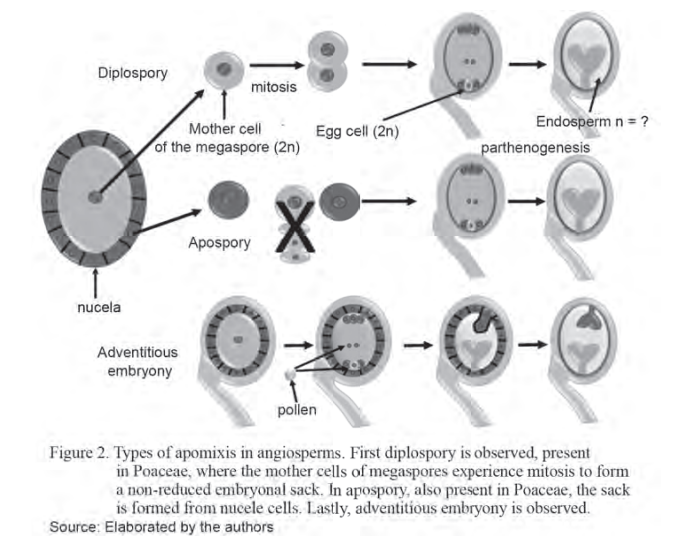

#### Parthenogenesis:

+ This mechanism is essentially equivalent to haploidy

+ The reduced (n) egg nucleus in a sexual embriyo sac develops into haploid embriyo without fertilizaiton by the sperm nucleus. 

### Maize x Tripsacum Hybridizaiton and the Transfer of Apomixis: Historical Review

+ One of the most interesting instances of intergeneric hybridization involves hybridizing maize (Z. mays L.)(2n=2x=20) with its distant relative eastern gamagrass *(T.dactyloides)* (2n=4x=72)

+ Regardless of thier complete difference in chromosome number, plant phenotype, and environmental niche, hybrids are relatively easy to generate.

+ <p style="color:gold;">The F1 hybrids completely pollen-sterile and microsporogenesis is asscoiated with a varying array of <u>meiotic anomalies</u></p>

+  <p style="color:brown;">The hybrids vary in seed fertility ranging from completely sterile to highly seed-fertile</p>

+ To date, all seed-fertile hybrids generated from tetraploid *T. dactyloides* exhibit some level of apomictic expression; however, backcrossing with maize commonly results in the loss of apomixis. 

### Constraints of Sexual Biology in Plant Breeding

+ Some constraints of sexual biology are exploited as tools for breeding plants

+ These include:

  + Dioecy

  + monoecy

  + Self-incompatibility

  + male sterility

### Pollination Control

+ A critical aspect of crossing is<p style="color:green;">pollination control to ensure that only the desired polen is involved in the cross</p>

+ Pollination control may be accomplished in three general ways:

  + **Mechanical control:** Manually removing anthers from bisexual flowers to prevent pollination, a technique called <u>emasculation</u>, or <u>removing one sexual part (e.g., detaselling in corn),</u> or <u>excluding unwanted pollen by covering the female part</u>

  + **Chemical Control:** a variety of chamicals called chemical hybridizing agents or other names (e.g., male gametocides, male sterilants, pollenocids, andorcides) are used to <p style="color:blue;">temporally induce male sterility</p> in some species. 

  + **Genetic Control:** Certain genes are known to impose constraints on sexual biology by incapacitating the sexual organ (as in male sterilty) or inhibitng the union of normal gametes (as in self-incompatibility).

### Dioecy and Monoecy

+ Some flowers are **complete** while others are **incomplete**

+ When separate male and female flowers occur on the same plant, the condition is called **<u>monoecy</u>**

+ When the sexes occur on different plants (i.e., there are female plants and male plants), the conditions is called **<u>dioecy</u>**

+ Examples of dioecious species include date, hops, asparagus, spinach, and hemp

+ The separation of the sexes means that all seed from dioecious species are hybrid in composition

+ Where the economic product is the seed or fruit, it is imperative to have female and male plants in the field in an appropriate ratio. <p style="color:gray;">In orchards, 3–4 males per 100 females may be adequate</p>

+ <p style="color:"red;">In hops, the commercial product is the female inflorescence; Unfertilized flowers have the highest quality</p>; Consequently, it is not desirable to grow pollinators in the same field when growing hops.

### Self-incompatibility

+ Self-incompatibility (or lack of self-fruitfulnes) is a condition in which the pollen from a flower is not receptive on the stigma of the same flower ans hence is incapable of setting seed.

+ This happens in spite of the fact that both pollen and ovule development are normal and viable

+ It is caused by a <p style="color=red;">genetically controlled</p> physiological barriers to self-fertilization. 

+ Self-incompatibility is widespread in anture, occuring in families such as poaceae, cruciferaei compositae, and rosaceae

+ The incompatibility reaction is genetically conditioned by a locus designated S, with multiple alleles that can number over 100 in some species such as *Trifolium pretense*

+ Unlike monoecy and dioecy, all plants produce seed in self-incompatible species. 

### Self-Incompatibility Systems

Self incompatibility systems may be clasified into two basic types:

+ **Heteromorphic**

+ **Homomorphic**

#### a. Heteromorphic Incompatibility

+ This is caused by differences in the lengths of stamens and style (called **<u>heterostyly</u>**).

+ In one flower type called the **<u>pin</u>**, the styles are long while anthers are short; in the other flower type, **thrum**, the reverse is true.

+ The pin trait is conditioned by the genotype ss while thrum is conditioned by the genotype Ss. A cross of pin (ss)x pin (ss) as well as thrum (Ss) x thrum (Ss) are <p style="color:orange;">incompatible</p>

+ However, pin (ss) × thrum (Ss) or vice versa, is <p style="color:green;">compatible</p> 

+ The condition described is **distyly** because of the two different types of style length of the flowers

+ In Lythrum three different relative positions occur (called **tristyly**)

+ Heteromorphic incompatibility showing floral modifications in which anthers and pistils are of different lengths in different plants (heterostyly)

+ This type of incompatibility is believed to be always of the sporophytic type

+ Pin and thrum flowers occurs in flowers such as Primula, Forsythia, Oxalis, and Silia

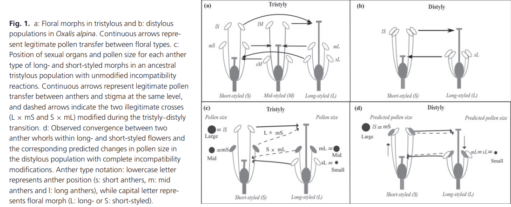

#### b. Homomorphic incompatibility

+ The system is called homomorphic because the flowering structures in both the seed bearing (female) and pollen-bearing (male) plants are similar

+ There are two kinds of homomorphic incompatibility;

  ***Gametophytic:***

  + – (originally called the oppositional factor system), the ability of the pollen to function is determined by its own genotype and not the plant that produces it
  
  + Gametophytic incompatibility is more widespread than sporophytic incompatibility
  
  + Gametophytic incompatibility occurs in species such as red clover, white clover, and yellow sweet clover
  
  + It is controlled by a series of alleles at a single locus (S1, S2,...Sn) or alleles at two loci in some species
  
  + The alleles of the incompatibility gene(s) act individually in the style; <p style="color:green;"> They exhibit no dominance</p>
  
  + <p style="color:blue;"> The incompatible pollen is inhibited in the style</p>
  
  + The pistil is diploid and hence contains two incompatibility alleles (e.g., S1S3, S3S4)
  
  + Reactions occur if identical alleles in both pollen and style are encountered
  
  + <p style="color:orange;"> Only heterozygotes for S alleles are produced in this system</p>

  ***Sporophytic:***

  + The incompatibility characteristics of the pollen are determined by the plant (sporophyte) that produces it
  
  + It occurs in species such as broccoli, radish, and kale and families such as Compositae and Cruciferae
  
  + The sporophytic system differs from the gametophytic system in that the <p style="color:brown;">S allele exhibits dominance</p>
  
  + <p style="color:gold;">Also, it may have individual action in both pollen and the style, making this incompatibility system complex</p>
  
  + <p style="color:"pink;">The dominance is determined by the pollen parent</p>
  
  + Incompatible pollen may be inhibited on the stigma surface
  
  + For example, a plant with genotype S1S2 where S1 is dominant to S2, will produce pollen that will function like S1
  
  + Furthermore, S1 pollen will be rejected by an S1 style but received by an S2 style. Hence, homozygotes of S alleles are possible

### Types of Self-incompatibility

- gametophytic incompatibility is associated with pollen with one generative nucleus in the pollen tube as occurs in various kinds of clover

- sporophytic incompatibility is associated with pollen grains with two generative nuclei

<p align="center"></p>

+ Incompatibility is expressed in one of three general ways, depending on the species

  + The germination of the pollen may be decreased (e.g., in broccoli)
  
    + Sometimes, removing the stigma allows normal pollen germination
    
  + Pollen germination is normal, but pollen tube growth is inhibited in the style (e.g., tobacco)
  
  + The incompatibility reaction occurs after fertilization (e.g., in Gesteria)
  
    + This third mechanism is rare

### Changing the Incompatibility Reaction

+ <p style="color:gray;">Mutagens (agnets of mutations) such as x-rays, radioactive sources such as p32,</p> and certain chemicals have been used to make a self-infertile genotype self-fertile. 

+ Such a change is easier to achieve in gametophytic systems than sporophytic systems

  + Doubling the chromosome number of species with the sporophytic system of incompatibility does not significantly alter the incopability reaction. 

  + This is because two different alelles already exist in a diploid that may interact to produce the incompatibility effect. 

  + polyploidy only makes more of such alleles available.

+ Doubling the chromosome in a gametophytic system would allow the pollen grain to carry two different alleles (instead of one).

  + The allelic interaction could cancel any incompatibility effect to allow selfing to be possible. 

  + Fro example, `diploid pear is self-incompatible whereas autotetraploids pear is self-fruitful.`

### Plant Breeding implicaitons of Self-Incompatibility 

+ Self-incompatibility may be temporarly overcome by techniques or strategies suchas `the removal of the stigma surface (or applicaiton of electric shcock), early polinaiton (before inhibitory proteins for), or lowering the temperature (to slow down the development of the inhibitory substance).`

+ `Self-incompatibility promotes heterozygosty.`

+ <u>Selfing self-incompatible plants can create significant variability from which a breeder can select superior recombinants.</u> 

+ Self-incompatibility systems for hybrid seed production have been established for certain crops (e.g., cabbage, kale) that exhibit sporophytic incompatibility

+ ***<u>Inbred lines (compatible inbreds) are used as parents</u>***

+ These systems are generally used to manage pollinations for commercial production of hybrid seed

+ <u>Gametophytic incompatibility</u> occurs in vegetatively propagated species. The clones to be hybridized are planted in adjacent rows

### Applicaiton of Self-Incompatibility in Practical Plant Breeding

+ Sporophytic incompatibility is iwdely used in breeding of cabbage and other *Brassica* species.

+ The single-cros hybrids are more uniform and easier to produce. 

+ The topcross is commonly used

+ A singlr self-incompatible parent is used as female, and is open-pollinated by a desirable cultivar as the pollen source

### Male Sterility 

+ ***Male sterility*** is a condition in plants whereby `the anthers or pollen are non-functional`

+ • Just like self-incompatibility, male sterility enforces cross-pollination

+ Similarly, it can be exploited as a tool to eliminate the need for emasculation for producing hybrid seed.

+ There are three basic kinds of male sterility based on the origin of the abnormality:

  + ***True male sterility:*** This is due to unisexual flowers that lack male sex organs (dioecy and monoecy) ot to bisexual flowers with abnormal or non-functional microspores (leading to pollen abortion)

  + ***Functional male sterility:*** The anthers fail to release conv ents even though the pollen is fertile. 

  + ***Induced male sterility:*** Plant breeders may use chemicals to induce sterility.

#### True Male Sterility

+ There are three kinds of pollen sterility <u>nuclear, cytoplasmic and cytoplasmic-genetic</u>

+ ***<u>Genetic (nuclear, genic) male sterility</u>***

  + It is believed that nearly all diploid and polyploid plant species have at least one male-sterility locus.

  + Genetic amle sterility may be manifested as <u>pollen abortion(pistillody)</u> or <u> abnormal anther development.</u>

  + Genetic male sterility is often conditioned by a single recessive nuclear gene, ms, the dominant allele, Ms, conditioning normal anther and pollen development. However, male sterility in alfalfa has been reported to be under the control of two independently inherited genes.

  + `The genetically male-sterile types (msms) can be propagated by crossing them with a heterozygous pollen source (Msms).`

  + `Male sterility may be chemically induced by applying a variety of agents.`

  <p align="center"></p>

+ ***<u>Cytoplasmic Male Sterility</u>***

  + Sometimes, male sterility is controlled by the cytoplasm (mitochondrial gene), but may be influenced by nuclear genes
  
  + A cytoplasm without sterility genes is described as normal (N) cytoplasm, while a cytoplasm that causes male sterility is called a sterile (s) cytoplasm or said to have cytoplasmic male sterility (CMS)
  
  + CMS is transmitted through the egg onl (maternal factor)
  
  + The condition has been induced in species such as sorghum by transferring nuclear chromosomes into a foreign cytoplasm (in this example, a milo plant was pollinated with kafir pollen and backcrossed to kafir)
  
  + CMS has been found in species including corn, sorghum, sugar beet, carrot, and flax
  
  + This system has real advantages in breeding ornamental species because all the offspring are male-sterile, hence allowing them to remain fruitless 
  
    + By not fruiting, the plant remains fresh and in bloom for a longer time

        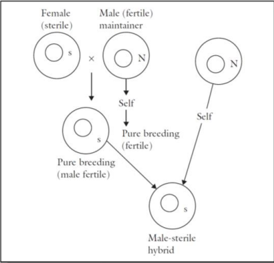

+ ***<u>Cytoplasmic-Genetic male Sterility</u>***

  + CMS may be modified by the presence of fertility-restoring genes (Rf) in the nucleus
  
  + CMS is rendered ineffective when the **<u>dominant allele for Rf</u>** occurs, making the anthers able to produce normal pollen 
  
  + As previously stated, CMS is transmitted only through the egg, but fertility can be restored by Rf genes in the nucleus
  
  + Three kinds of progeny are possible following a cross, depending on the genotype of the pollen source
  
  + The resulting progenies assume that the fertility gene will be responsible for fertility restoration


# LECTURE 4

## Genetic Marker 

+ In conventional plant breeding, genetic variation is usually identified by `visual selection`

+ With the development of molecular biology, it can now be identified at the molecular level based on chnages in the DNA and their effect on the phenotype 

+ Molecular changes can be identified by the many techniques that have been used to label and amplify DNA and to highlight the DNA variation among individuals. 

+ Once the DN Ahas been extracted from plants or their seeds, variation in samples can be identfied using a `PCR` and/or `hybridization process followed by polyacrylamide gel electrophoresis (PAGE)` or `capillary electrophoresis (CE)` to identify distinct molecules based on their sizes, chemical composition and charges.

`Hybridization in simple terms is defined as the breeding of two different organisms from genetically diverse groups or species. Hybridization is largely dependent on the sexual cross between two genetically distant strains of the same species, but due to the presence of various reproductive barriers, breeding was limited to sexually compatible groups, thus limiting the gene flow, which resulted in limited opportunities to improve the crop genotype` These notes are taken from the [vuduntu](https://www.vedantu.com/biology/hybridization-in-plants) page.

+ Genetic markers are used to tag and track genetic variaiton in DNA samples. 

```markdown
+ Hastalık direnç geni ressesif selfing vardır (backcross işlemi için)
+ Backcross işleminde donorun geni elimine ediliyor.
```
***<u>NOTE:</u>*** you can find more information about **backcross** at the [backcross](https://passel2.unl.edu/view/lesson/a5fae15430a3/2) page. 

+ Genetic markers represent genetic differences between individual organisms or species. 

+ Generally, they do not represent the target genes themeselves but act as `signs` or `flags`

+ Genetic markers that are located in close proximity to genes (i.e. tightly linked) may be reffered to as gene ``tags`.

+ Such markers themeselves do not affect the ğhenotype of the trait of interest because they are located only near or 'linked' to genes controlling the trait. 

+ All genetic markers occupy specific genomic positions within cheomosomes (like genes) callleed `loci` (singular locus).

## Desirable Criteria of Genetic Markers

+ High level of genetic polymorphism

+ Co-dominance (so that heterozygotes can be distincguished from homomzygotes)

+ Clear distinct alllele features (so that different alleles can be identified easily)

+ Even distribution on the entire genome

+ Neutral selection (without pleiotropic effect)

+ Easy detection (so that the whole process can be automated)(`PCR falan filan`)

+ Low cost of marker development and genotyping

+ High duplicability (so that the data can be accumulated and shared between laboratories) 

## Three Major Types of Genetic Markers

+ ***`Morphological (Classical or visible) markers;`*** which themselves are phenotypic traits or characters

  + Morphological markers are usually visually characterized phenotypic characters such as <u>flower colour, seed shape, growth habits or pigmentation</u>.

+ ***`Biochemical markers;`*** which include allelic variants of enzymes called isozymes. 

  + Isozyme markers are differences in enzymes that are detected by electrophoresis and specific staining

+ The major disadvantages of morphological and biochemical markers are that they may be limited in number and are influenced by environmental factors or the developmental stage of the plant (DNA markers are not affected these disadvantages)

+ Despite these limitations, morphological and biochemical markers have been extremely useful to plant breeders.

+ ***`DNA (or molecular) markers;`*** which reveal sites of variation in DNA.

  + They arise from different classes of DNA mutations such as substitution mutations (point mutations), rearrangements (insertions or deletions) or errors in replication of tandemly repeated DNA.

  + These markers are selectively **neutral** because they are usually located in non-coding regions of DNA.

  + Apart from the use of DNA markers in the construction of linkage maps, they have numerous applications in plant breeding such as assessing the level of genetic diversity within germplasm and cultivar identity.

## DNA markers

+ Linkage maps have been utilised for identifying chromosomal regions that contain genes controlling simple traits (controlled by a single gene) and quantitative traits using QTL analysis.

+ The process of constructing linkage maps and conducting QTL analysis -to identify genomic regions associated with traits- is known as QTL mapping (also genetic, gene or genome mapping).

+ DNA markers that are tightly linked to agronomically important genes (called gene 'tagging') may be used as molecular tools for `marker-assisted selection (MAS)` in plant breeding. 

  + MAS involves using the prsence/absence of a marker as a substitute for or to assist in phenotypic selection, in a way which may make it more efficient, effective, reliable and cost-effective compared to the more conventional plant breeding methodology

+ DNA markers are widely accepted as potentially valuable tools for crop improvement in rice, wheat, maize , barley, tuber crops, pulses, oilseeds, horticultural crop species and pasture species

## Sources of Variation Exploited by the Breeder

Variability available for the plant breeder.

Plant genetic resources 

+ Related wild species which mainly occur in 'gene centers' of cultivated plants or outside them. 

+ Weed races which occur as part of crop-weed complexes

+ Landraces, products of traditional agriculture
  
+ Modern breeding lines and genetic stocks (in hands of breeders)

+ Obsolete cultivars

+ Modern cultivars

Interspecific hybridization 

+ through sexual means -limited to closely related species

+ Also a common phenomenon in nature, as one mechanism of evolution. 

+ specially interesting in vegetatively propagated crops, due to frequent problems with the fertility of the hybrid. 

+ Somatic hybridization- also applicabe to less related species, as far as the embriyo develops normally (otherwise embriyo-recuse techniques can be applied.)

Induced mutations

+ Using radiations or chemicals

+ Used to be broadly applied in ornamentals

Chromosome manipulation and polyploidy (how is chromosome manipulation done? it is done by colchicine )

+ haploids, diploids, tetraploids…

Gene transfer

+ Isolation of genes of relevance and transfer to the same or to a different species

## Contribution of DNA Markers: The Problems 

+ the phenotype is an imperfect predictor of the genotype

+ The phenotype is not effective in resolving negative associations between genes (linkage, epistasis)

## Contribution of DNA Markers: Direct Reflection of the Genotype

+ Two plants can display similar phenotypes, but be very different from a genetic point of view.

+ Two plants can display different phenotypes, but be very similar from a genetic point of view

## Contribution of DNA Markers: Heterosis, Hybrid Breeding

factor as heterosis are due to genotypic divergence (in contrast to phenotypic differences)

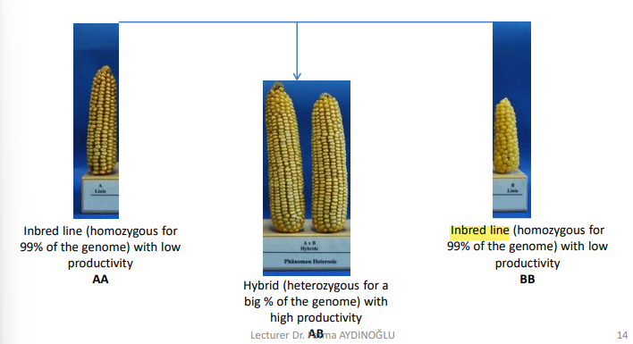

## Contribution of DNA markers: Introgression Breeding

+ Breeders want to introduce into their cultivated plants only the gene(s) of interest while conventional breeding methods rely on the transfer of the whole genome (along the gene of interest, undesirable characters are also co-inherited and have to be eliminated through back crossing followed by selection)

  + Al least 20 backcroos (BC) generations are required for the recovery of full recurrent genome. 

+ The introgression of recessive alleles through classical back cross breeding is even more lengthy as this requires additional `generations of selfing after every back crossing`

+ Some characters like complex disease resistance reaction or biotic stresses that show continuous variation and do not fit into Mendelian ratios are most difficult to detect and transfer through conventional plant breeding

## How can DNA Markers Help?

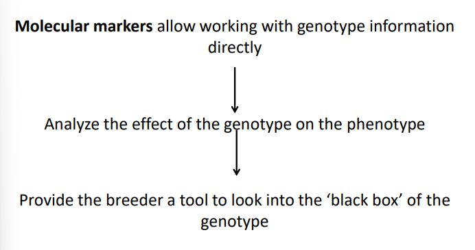

+ If we analysis the DNA-sequences we can 'fingerprint' the DNA of each individual.

+ This information can be used to identify:

  + the individual 

  + Chromosome pieces transferred from one individual to its progeny. 

## Molecular DNA Defined 

A molecular marker is a sequence of DNA or a protein which can be readily detected and whose inheritance can be monitored. 

+ It is the variation in, or the polymorphism of, molecular markers which can be used. 

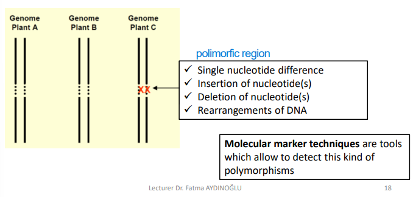

## Why are DNA markers useful?

+ They allow us to follow the chromosomal segments which are passed on from one generation to the next
 
+ Have a simple Mendelian inheritance (in contrast to most phenotypic traits).

  + They do not interact among themselves

  + They are not influenced by the environment. 

+ Enable to identify the carriers of recessive alleles of genes

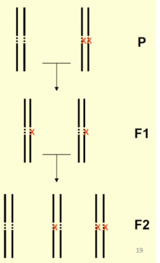

## Two basic Types of DNA Markers

+ Causal mutations: the mutation is responsible for the change in the color of the flower

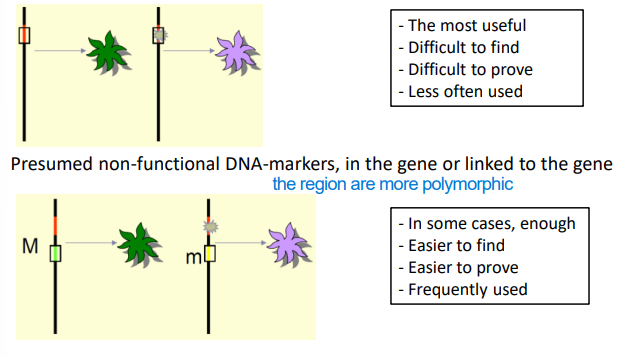

## Field of Application

Understanding germplasm relationships

+ Markers are useful in four types of measurements needed in this field:

  + **identify:** correct lable of plants

  + **similarity:** degree of relatedness among plants

  + **Structure:** is possible to identify groups of related plants. 

  + ** Detection:** Posses some plants of the collection a particular allele of a gene.

Constructions of genetic linkage maps and tagging economically important genes

+ Segregating population constructed using plants with contrasting characteristics

+ Through linkage analysis (analysis of the co-segregation of markers) a genetic map is constructed

+ By combining phenotypic data with genetic-map information, identify markers which are linked to the gene(s) responsible of the trait

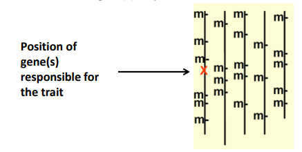

Marker assisted selection

+ Use markers linked to agronomic traits to select the best plants to cross

+ In most cases, selection has to be performed for more than one trait simultaneously

+ In some cases we are interested in the introgression of a specific genome region

analysis of syntenic relationship between genomes

+ Genetic maps of different species in which common markers have been placed

+ By comparison of the location of the common markers is possible to look for `conserved marker orders` 

Cultivar identification

+ useful to control the identify of reproductive material (seeds,grafts, bulbs...)

+ Useful to control the unauthorised use of cultivarars from other breeders. 

## DNA Markers: Desired Properties

+ Polymorphic: able to detect many different alleles

+ Co-dominant: if one individual carries two different alleles we can visualise both

+ Occurs throughout the genome

+ Easy, fast and inexpensive to detect

+ Reproducible within and between laboratories

  + No single technique fulfills all these criteria

  + Choice of DNA fingerprinting technique depends upon the infrastructure, technical expertise and operational funds available as well as requirements of the experiment

## Three Classes of DNA Markers

These classes based on the method of their detecction:

+  Hybridization-based (blotting is an example of hybridization)

+ Polymerase chain reaction (PCR)-based 

+ DNA sequence-based

## Polymorphic markers

+ Essentially, DNA markers may reveal genetic differences that can be visualised by using a technique called gel electrophoresis and staining with chemicals (ethidium bromide or silver) or detection with radioactive or colourimetric probes

+ DNA markers are particularly useful if they reveal differences between individuals of the same or different species 

+ These markers are called polymorphic markers, whereas markers that do not discriminate between genotypes are called monomorphic markers

+ DNA markers are particularly useful if they reval differences between individuals of the same or different species. These markers are called `polymorphic markers`, whereas markers that do not discriminate between gentypes are called `monomoric markers`. 

```Markdown
Molecular marker signals that are used to reveal genotypic differences between individuals due to marker sequence differences are called polymorphic markers. On the other hand, DNA markers that cannot be used to differentiate between or among genotypes are referred to as monomorphic markers.
```

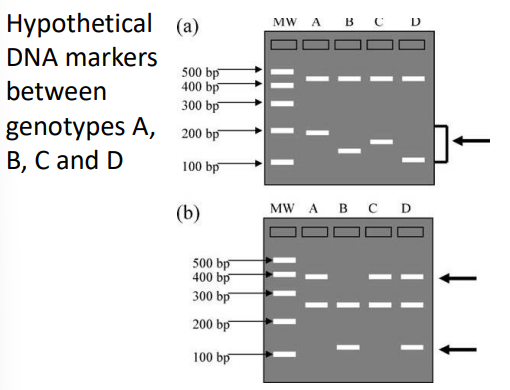

+ Polymorphic markers are indicated by arrows. Markers that do not discriminate between genotypes are called monomorphic markers.

  + a. Example of SSR markers. The polymorphic marker reveals size differences for the marker alleles of the four genotypes, and represent a single genetic locus.
  
  + b. Examples of markers generated by the RAPD technique. Note that these markers are either present or absent.

+ For both polymorphic markers, there are only two different marker alleles.

## Co-dominant or dominant markers

+ Polymorphic markers may also be described as co-dominant or dominant

+ This description is based on whether markers can discriminate between homozygotes and heterozygotes

+ Co-dominant markers indicate differences in size whereas dominant markers are either present or absent 

+ Strictly speaking, the different forms of a DNA marker (e.g. different sized bands on gels) are called marker ‘alleles’

+ <u>Co-dominant markers may have many different alleles whereas a dominant marker only has two allele.</u>

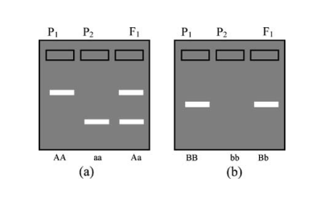

+ Co-dominant markers (a) can clearly discrim
nate between homozygotes and heterozygotes whereas dominant markers (b) do not. Genotypes at two marker loci (A and B) are indicated below the gel diagrams. 

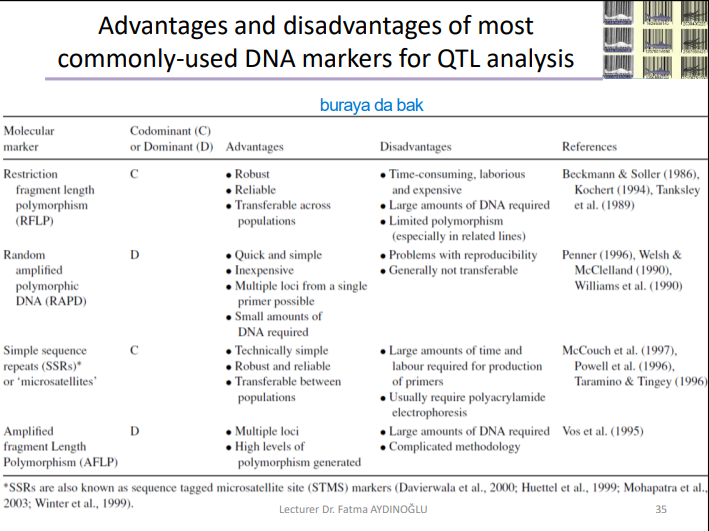

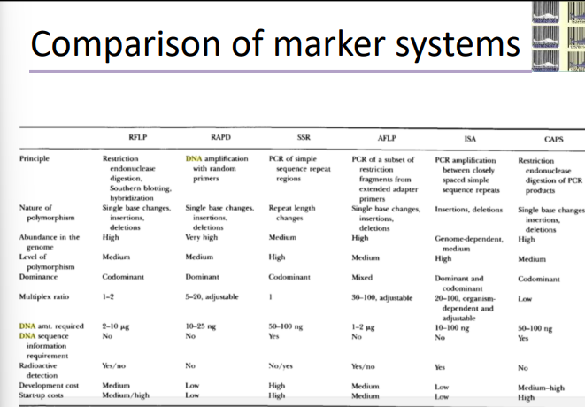

## DNA-markers: Techniques

+ A marker technique is a procedure to detect DNA-polymorphisms between chromosomes (within the same individual) or between individuals

+ The purpose is to reveal polymorphisms between chromosomes without actually sequencing the fragments

+ Many different techniques are available for the detection of polymorphisms at the DNA sequence level (sometimes two different acronyms are used to refer to the same kind of marker)

+ Techniques vary in:
  
  + Protocol

  + Type of data generated

  + Multiplex ratio (number of loci screened per assay)

  + Taxonomic levels at which they are applicable

  + Technical and financial requirements

  + Fields of application

+ No single marker-techniques is ‘perfect’. The choice depends on:

  + Objectives of study

  + Facilities and technical skills
  
  + Money

  ## Definition of 'DNA Marker technique'

  + The use of DNA markers is based on polymorphisms

  + Genetic variation bears on the detection methods we employ.

  + Studies have shown that

    + Base pair changes are more frequent than large rearrangements,
    
    + Heterogeneity is not restricted by coding regions,
    
    + Polymorphisms at the DNA level are much frequent than are charge changes in proteins

  + The polymorphisms present in natural populations differ markedly in different species (average in humans: 1-2 bp/1000 bp; average in maize: 40 bp/1000 bp)

  + The level of variation in a species affects our ability to perform marker analysis. 

  + If one trait is influenced by more than one gene, DNA-markers in different genomic loci will show association with the traits. 

  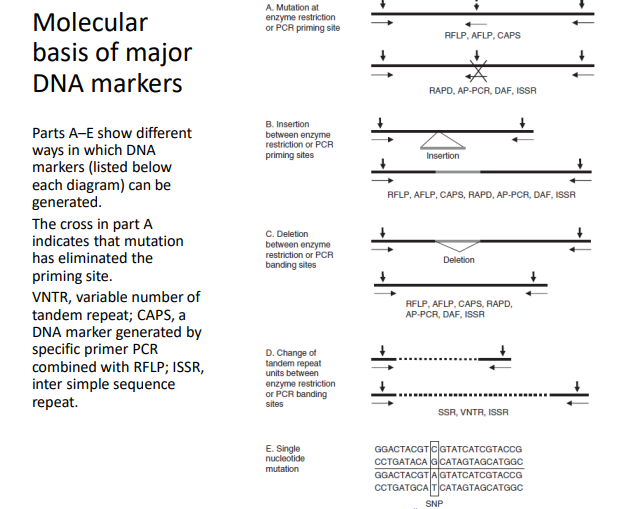

  ## Steps in DNA-Marker Generation

  + DNA extraction

  + Method to zoom in the genome (PCR amplification/restriction of DNA)

  + Seperation of the selected from the non-selected DNA fragments

  + Visualisation of one or more than one loci in the genome (in most cases, a computer image)

  + Interpretation of this image

  + Data analysis

## RFLP (Restriction fragment length polymorphism): Definition 

+ involves the study of the variation in DNA restriction fragment length

+ Examines differences in size of specific DNA restriction fragments

+ Usually performed on total cellular DNA

+ Requires relatively big quantities of pure, high molecular weight DNA.

```Markdown
is a difference in homologous DNA sequences that can be detected by the presence of fragments of different lengths after digestion of the DNA samples in question with specific restriction endonucleases. RFLP, as a molecular marker, is specific to a single clone/restriction enzyme combination.

Most RFLP markers are co-dominant (both alleles in heterozygous sample will be detected) and highly locus-specific.

An RFLP probe is a labeled DNA sequence that hybridizes with one or more fragments of the digested DNA sample after they were separated by gel electrophoresis, thus revealing a unique blotting pattern characteristic to a specific genotype at a specific locus. Short, single- or low-copy genomic DNA or cDNA clones are typically used as RFLP probes.
```

## RFLP: Steps

+ Select the probe to use

+ Cut the DNA in smaller fragments using one restriction enzyme:

  + This choice is crucial
  
  + Different restriction enzymes will cut different DNA fragments and provide independent information (if combined with different probes)

+ Separate the fragments by gel electrophoresis

+  Denature the agarose gel is using NaOH solution and then neutralize

+ Transfer the DNA fragments to a filter by Southern blotting

+ Hybridize with a labeled probe (radioactive / fluorescent)

+  Wash the membrane to remove nonspecifically hybridized DNA

+ ‘Visualize’ the DNA-fragments

+ Differences in band pattern reflect genetic differences

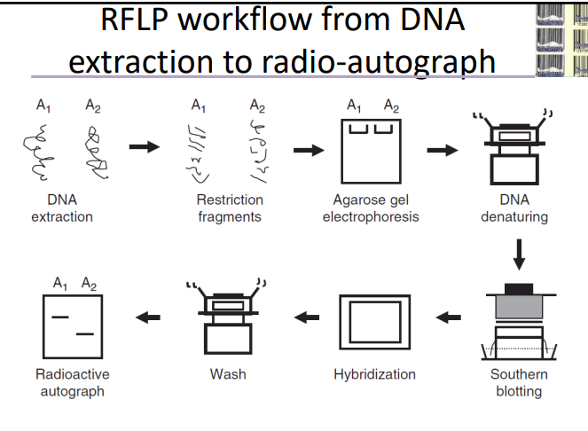

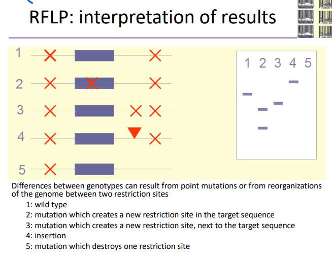

## RFLP: Probes

+ ***Single locus:*** Usually species specific, but cross-species hybridization is possible in some cases. 

  + Piece of nuclear DNA (mostly part of a gene)

  + Piece of cytoplasmic DNA.

+ ***Multi locus:*** Usually the same probe can be used in different species

  + *Tandem repeats:* mini- en microsatellite sequences

  + **minisatellite sequence:** Short DNA motifs (10-60 base pairs) which occur as tandem repeats at many loci of the genome. Also called VNTR(variable Number of Tandem Repeats)

  + **Microsatellite sequence:** Shorter (1-5 base pair). ALso called SSR(Simple Sequence Repeat)

+ In the example, two loci were detected, but we still call this test single locus, as we were able to distinguish the two loci. 

## RAPD (Random amplified polymorphic DNA): Definition

+ Involves the PCR amplification of DNA fragments using short primers (+/- 10 nucleotides)

+ Requires little quantities of DNA

+ Technically simple

+ Reproducibility can be low (due to short primers and low stringency PCR conditions)

## RAPD: Steps

+ Extract DNA 

+ Amplify DNA fragments in a PCR reaction using one short primer

+ Separate the PCR products by agarose gel electrophoresis

+ ‘Visualize’ the DNA-fragments (e.g. ethidium bromide)

+ Usually multiple loci are amplified and differences in band pattern reflect genetic differences

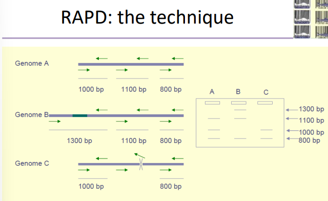

## SSR (Simple sequence Repeat): Definition 

+ Involves the study of the variation in number of repeat units at a given locus.

+ Repeat units are short. Repeats can be simple or interrupted. 

+ Examines differences in size of specific DNA fragments

+ Usually performed on total Cellular DNA

+ Requires little amounts of DNA. 

## SSR: Steps

+ Extract DNA 

+ Amplify DNA fragments in a PCR reaction using two highly specific primers

  + Finding these primers can be time-consuming and expensive

+ Separate the fragments by (polyacrylamide) gel electrophoresis

+ ‘Visualize’ the DNA-fragments (e.g. ethidium bromide / silver staining/ fluorescent labeling)

+ Usually several alleles at one locus are amplified

+ Differences in band length reflect genetic differences (between chromosomes of the same individual or between chromosomes of different individuals). 

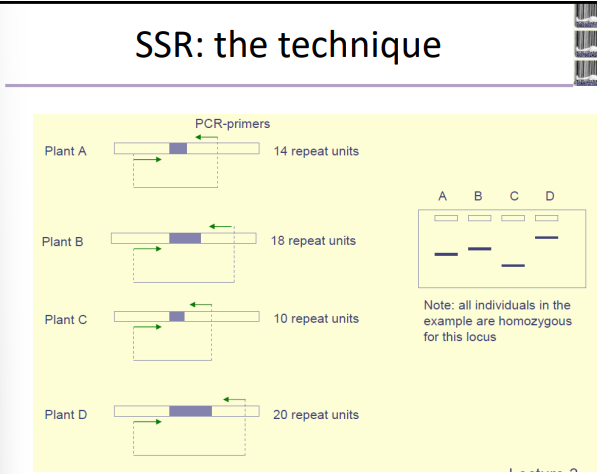

## SSR: Primers

+ Primers are derived from DNA sequence information in the regions flanking the SSr-motif. 

+ This information is derived from:

  + Knowledge in other (related) species


    + Some primer pairs in Malus domestica can be used in Malus sylvestris
    
    + Some primer pairs in Medicago truculata can be used in Medicago sativa

  + Genomic libraries / cDNA libraries

    + Development of library
    
    + Enrichment for SSR sequences (optional)
    
    + Identification of clones containing SSR inserts
    
    + Sequencing of these clones
    
    + Primer pair development

  + Databases (search for SSR motifs in sequences of public databases)
  
  + PCR-based method Hayden & Sharp (2001): isolation of sequence tags for SSR fragments, which are ligated to form concatemers for cloning and sequencing. Based on these tags, primers for the amplification of specific SSR loci are developed

## Site Targetted PCR other than SSR

+ Same steps required as for SSR detection

+ Single locus studied in one reaction, using specific primer pairs

+ Examine polymorphisms in specific DNA fragments

  + Size differences (determined after gel electrophoresis)
  
  + DNA sequence differences (determined by restriction enzymes)

+ Usually performed on total cellular DNA

+ Requires little amounts of DNA

+ Two general types:

  + STS: markers which amplify sequences of which do not know whether they are expressed or not
  
  + EST: markers targeting expressed sequences (pieces of genes)

  ## AFLP (Amplified Fragment length polymorphism): Definition

  + Identifies length polymorphisms is amplified restriction fragments

  + Examines multiple loci in one single reaction. 

  + Usually performed on total cellular DNA

  + Requires little amounts of DNA.

  + Fluorescent labeling and detection on automic sequences allow some automation. 

  + Several steps involved= Relatively difficult to perform, skilled operators required. 

  ## AFLP: Steps

  + Extract DNA 

  + Digest the DNA using two restriction enzymes
  
    + Usually one Hexacutter (eg. EcoRI) and one Tetracutter (MseI)
    
  + Ligate double stranded adaptors to the restriction fragments
  
  + Perform one PCR amplification using primers complementary to the adaptor sequence
  
    + These primers are usually extended with 1 or 2 ‘selective nucleotides’

  + Perform a second PCR amplification using labeled primers complementary to the adaptor sequence
  
    + These primers are usually extended with 1-4 ‘selective nucleotides’
    
  + The total number of selective nucleotides required depends on the complexity of the genome to be analyzed:
  
    + Bacteria: 0-2 selective nucleotides
    
    + Fungi: 3-5 selective nucleotides
    
    + Plants: 5-8 selective nucleotide

```Markdown
Amplified fragment length polymorphism (AFLP) is a PCR-based technique that uses selective amplification of a subset of digested DNA fragments to generate and compare unique fingerprints for genomes of interest. The power of this method relies mainly in that it does not require prior information regarding the targeted genome, as well as in its high reproducibility and sensitivity for detecting polymorphism at the level of DNA sequence. Widely used for plant and microbial studies, AFLP is employed for a variety of applications, such as: to assess genetic diversity within species or among closely related species, to infer population-level phylogenies and biogeographic patterns, to generate genetic maps and to determine relatedness among cultivars. Variations of standard AFLP methodology have been also developed for targeting additional levels of diversity, like transcriptomic variation and DNA methylation polymorphism.
```

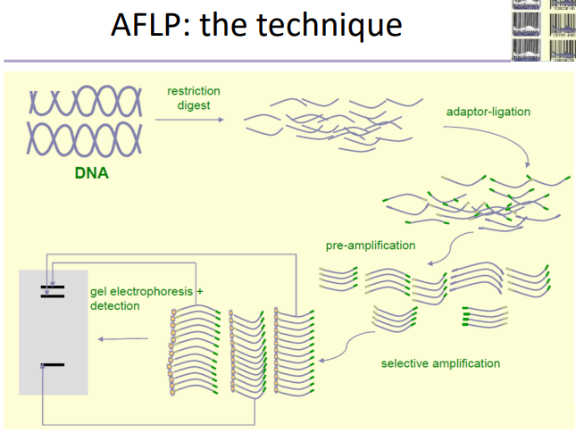

## AFLP Flowchart

+ Adabtor DNA= short double strand DNA molecules, 18-20 bp in length, representing a mixture of two types of molecules. 

+ Each type is comparable with one restriction  enzyme generated DNA end. 

+ Pre-amplificaitons uses selective primers, which contain an adaptor DNA sequence plus one or two random bases at the 3' end for reading into the genomic fragments. 

+ Primers for re-amplificaiton have the pre-amplification primer sequecne plus one or two additional bases at the 3'end.

+ A tag is attached at the 5' end of one of the re-amplificaiton primers for detecting amplified molecules. 

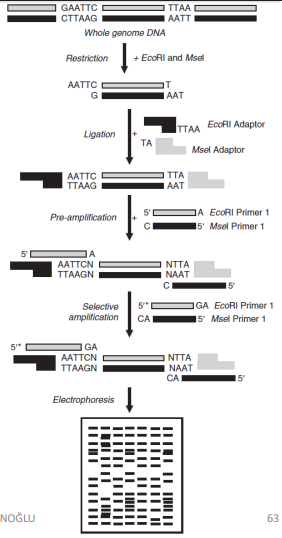

+ Basis of the polymorphisms detected:

  + Changes in the restriction enzymes recognition sites
  
  + Changes in the recognition sites of the primer extensions (selective nucleotides)
  
  + Insertions/deletions within the DNA fragment
  
+ Multilocus fingerprint is generated. In most cases, impossible to determine allelic relationships between AFLP fragments


***<u>Note:</u>*** each addition of one selective nucleotide will result in a reduction of ¼ of fragments amplified

=> This is one of the most important characteristics of the AFLP technique: ‘flexibility’

## AFLP: Primer Combinations

+ AFLP primer combinations are identified by:

  + The restriction enzymes used to generate the DNA fragments
  
  + The selective nucleotides added to the primer sequences
  
+ Examples: EcoRI- ACG + MseI-CT ; PstI-ACTG + MseI-CTT

+ Different primer combinations generate (in principle) independent data, as they sample different genome loci

+ When we start to work with a new species we need to determine:

  + The restriction enzymes which perform best (incomplete digests will result in non-reproducible results)
  
  + The number of nucleotides which are required to get informative fingerprints (small genome: less selective nucleotides; big genomes: more selective nucleotides)
  
  + The nature of the nucleotides used in the extensions (AT rich / CG rich …)
  
  + The reproducibility of the protocol applied: given the complexity of the protocol applied artifacts can appear. Testing the reproducibility is thus of crucial importance

+ We can use information derived from studies in similar species as guideline for number of selective nucleotides restriction enzymes

## SNP (single nucleotide polymorphism): Definition

+ Allele 1 ATGTGCATTA  Allele 2 ATGTCCATTA: There is a different nucleotide.

+ Offer the oppotunity to uncover allelic variation directly within expressed sequences of candidate genes and to develop haplotypes based on gametic phase disequlibrium.

+ SNPs result from single base substitutions in the DNA sequence

+ Are the most abundant form of DNA polymorphisms in most organisms

+ Cannot be resolved by conventional gel electrophoresis, and novel technologies have been developed (capillary electrophoresis, MALDI-TOF mass spectrometry, pyro sequencing , dHPLC,DNA arrays...)
 
+ Most SNP detection protocols involve target sequence PCR amplificaiton, often with fluorescent lableing technologie, enzymatic assays or a combination thereof.

## Types of DNA Markers

Function:

+ Functional (detect the mutation which is directly responsible for a change in the phenotype)
  
+ Non functional

  + In the gene
  
  + In the neighbourhood of the gene

Transmission:

+ Biparental

+ Uniparental

Information-content

+ Co-dominant (visualisation of all alleles present)

+ Dominant (visualisation of only one allel)

Detection system and multiplex ratio

+ PCR-based / hybridisation-based

+ Simplex / Multiplex

## Mode of Transmission

Uniparental vs. biparental

+ Biparental nuclear inheritance: Nuclear DNA markers in plants and animals

+ Maternal organellar inheritance: Mitochondrial and chloroplast DNA-markers in angisoperms

+ Paterna organellar inheritance: mitochondrial and chloroplast DNA-markers in gymnospers.

## Information Content

Codominant

+ RFLP

+ SSR

+ STS

+ SNP

Dominant

+ VNTR

+ RAPD

+ AFLP

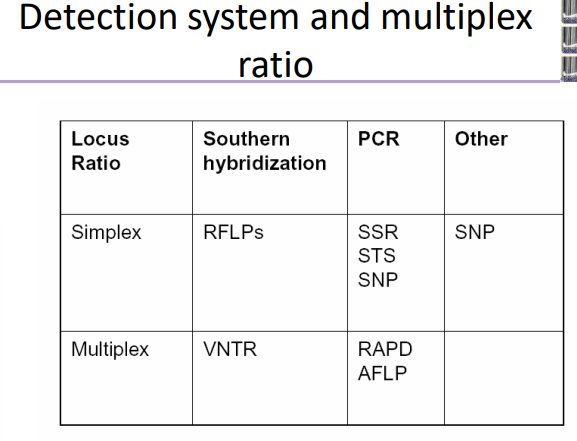

# Lecture 6

## Molecular Maps: Linkage Mapping

The order and relative distance of geneticfeatures that are associated with geneticvariation or polymorphisms can be determinedby genetic mapping.

**Genome maps** are detailed constructs of the order and/or position of genetic markers and DNA sequence. 

Genetic maps constructed using molecular markers cam also be used to locate major genes which can then also be used as genetic markers 

Maps are two types;

+ **Genetic Maps (Linkage maps):** Use recombinaiton frequencies of markers at *meiosis* 

```Markdown 
A genetic map (also called a linkage map) shows the relative location of genetic markers (reflecting sites of genomic variants) on a chromosome. A genetic map is based on the concept of genetic linkage: the closer two markers are to each other on a chromosome, the greater the probability that they will be inherited together. By studying inheritance patterns, the relative order and location of genetic markers along a chromosome can be established.
```

+ **Physical Maps: Identify exact location of DNA sequence in the genome.

```Markdown
A physical map, as related to genomics, is a graphical representation of physical locations of landmarks or markers (such as genes, variants and other DNA sequences of interest) within a chromosome or genome. A complete genome sequence is one type of physical map. Physical maps are used to identify genes or other sequences believed to play a role in health conditions or diseases. They are also valuable in providing an organizational framework for generating complete sequences of genomes.
```

### Linkage Maps:

Graphical representation of gneome

+ Using polymorphic markers (DNA markers, Protein markers, metabolic and phenotypi markers)

+ **Recombination frequency:** The number of recombinant gametes per 100 gametes. 

+ **Cloesly linked loci:** Recombinaiton frequency must be <50%

+ **Independent Loci:** Recombinaiton frequency must be = 50%

#### Chromosme Theory and Linkage:

+ During the first meiotic division, the homologous chromosomes align and stick together in a process called **synapsis**.

+ **Crossing over** is the process by which homologous chromosomes exchange portions of their chromatids during meiosis, resulting in new combinations of genetic information and thus **affecting inheritance and increasing genetic diversity.**

+ Genes that are present togwther on the same chromosome tend to be inherited together and are referred to as **linked**.

+ The proportion of recombinant gametes depends on the rate of crossover during meiosis and is known as the **recombinant frequency** 

<u>The recombinant frequency depends on the rate of crossover which in turn depends on the linear distance between two genetic loci.</u>

#### Construction of Linkage Maps:

+ The most important use for linkage maps is to identify chromosomal locations containing genes and QTLs assocaited with traits of interest; such maps may then be referred to as 'QTL (or genetic)' maps

+ **QTL mapping** is based on the prenciple that genes and markers segregate via chromosome recombinaiton (called cross over) during meiosis, thus allowing their analysis in the progeny. 

+ Genes or markers that are close together or tightly-linked will be trasnmitted together from parent to progeny more frequenty than genes or markers that are located further apart. 

+ THe frequency of recombinant genotypes can be used to calculate recombination fractions, which may by used to infer the **genetic distance between markers**

+ By analyzing the segregation of markers, the relative order and distances between markers can be determined- the lower the frequency of recombianiton between two markers, the closer theyare situated on a chromosome (conversely, the higher the frequency of recombinaiton between two markers, the further away they are situated on a chromosome). 

+ Markers that have a recombinaiton frequency of 50% are described as 'unlinked' and assumed to be located far apart on the same chromosome or on different chromosomes. 

#### Linkage Mapping

+ Mapping functions are used to convert recombination fractions into map units called centi-Morgans(cM) 

+ Linkage maps are constructed from the analysis of many segregating markers

+ The main steps of linkage map construction are:

  + Production of a mapping population
  
  + Identification of polymorphism
  
  + Segregation analysis
  
  + Determination of linkage groups (comput
  onal)
  
  + Determination of marker order

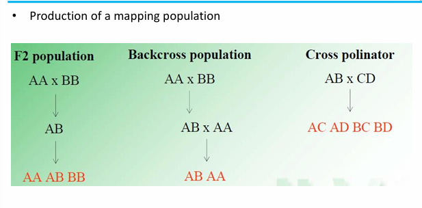

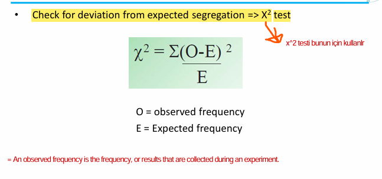

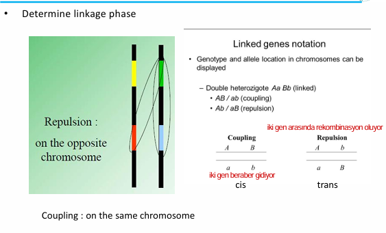

Marker order in a linkage group 

+ Map function translates recombination frequencies into map distances 

  + **Haldane Function** 

    Takes into account double strand, three and four strand crossovers. But assumes that 2-3-4 strand corssovers does not interfere with single crossovers. 

  + **Kossambi Funciton:**

    Takes into account interference. 

 ```Markdown
When map distances are small (<10 cM), the map distance equals the recombination frequency. However, this relationship does not apply for map distances that are greater than 10 cM. Hence, the researcher must select one of the two genetic mapping functions (Haldane or Kosambi), which translates recombination frequencies into map distances and vice versa. Haldane’s mapping function (Haldane, 1931) assumes absence of interference between crossovers in meiosis, whereas Kosambi’s mapping function (Kosambi, 1944) assumes a certain degree of interference. Interference is the effect in which the occurrence of a crossover in a certain region reduces the probability of a crossover in the adjacent region. Such mapping functions convert recombination fractions into map units called centimorgans (cM) in honor of the geneticist Thomas Hunt Morgan. By definition, one map unit (m.u.) is equal to one percent recombinant phenotypes or 1 cM. For recombination frequentcies above 10%, Haldane mapping functions gives higher map distance than Kosambi; hence, the total map length of a species will be much higher for the Haldane’s than Kosambi’s mapping function.
```

### Mapping Populations

+ The parents selected for the mapping population will differ for one or more traits of interest. 

+ Population sizes used in preliminary genetic mapping studies generrally range from 50 to 250 individuals, however larger populations are required for high-resolution mapping. 

+ If the mapp will be used for QTL studies, then an important point to note is that the mapping population must be phenotypically evaluated before subsequent QTL mapping. 

+ Generally **in self-pollinaitng species**, mapping populations origiante from parents that are both highly homozygous (inbred)

+ In cross pollinating species, the situation is more complicated since most of these species do not tolerate inbreeding. 

+ Mapping populations used for mapping cross pollinating species may be derived from a cross between a heterozygous parent and a haploid or homozygous parent. 

#### Advantages and Disadvantages of Several Mapping Populations:

+ F2 populations, derived from F1 hybrids, and backcross (BC) populations, derived by crossing the F1 hybrid to one of the parents, are the simplest types of mapping populations developed for self pollinating species. 

+ Inbreeding from individual F2 plants allows the construction of recombinant inbreed (RI) lines, which consist of series of homozygous lines, each containing a unique combination of chromosomal segments from the original parents. 

  + The lenght of time needed for producing RI populations is the major disadvantage, because  usually six to eight generations are required. 

+ Doubled haploid (DH) populations may be produced by regenerating plants by the induction of chromosome doubling from pollen grains, however, the ptoduction of DH populations is only possible in species that are amenable to tissue culture. 

+ The major advantages of RI and DH populations are that they produce homozygous or ‘true-breeding’ lines that can be multiplied and reproduced without genetic change occurring

+ This allows for the conduct of replicated trials across different locations and years

+ Thus bothRI and DH population srepresent‘eternal’ resources for QTL mapping

+ Furthermore, seed from individual RI or DH lines may be transferred between different laboratories for further linkage analysis and the addition of markers to existing maps, ensuring that all collaborators examine identical material. 

```Markdown
The first step in producing a mapping population is selecting two genetically divergent parents, which show clear genetic differences for one or more traits of interest. The parents should be genetically divergent enough to exhibit sufficient polymorphism and at the same time they should not be too genetically distant so as to:
a) Cause sterility of the progenies and/or 
b) Show very high levels of segregation distortion during linkage analysis.
```

As shown in Figure below progenies from the second filial generation (F2), backcross (BC), recombinant inbred lines (RILs), double haploids (DHs), and near isogenic lines (NILs) can be used for genetic mapping in self-pollinating species (Burr et al.,1988; He et al., 2001; Doerge, 2002). Selection of populations is critical to successful linkage mapping. F2 populations are developed by selfing F1 hybrids derived by crossing the two parents while BC population is produced by crossing F1 back into one of the parents (the recipient or recurrent parent). RILs are developed by single-seed selections from individual plants of an F2 population; such selections continue for six to eight generations. If backcross selection is repeated at least for six generations, more than 99% of the genome from BC6 and above will be derived from recurrent parent (Babu et al., 2004). Selfing of selected individuals from BC7F1 will produce BC7F2 lines that are homozygous for the target gene, which is said to be nearly isogenic with the recipient parent (NILs). NILs are frequently generated by plant breeders as they transfer major genes between varieties by backcross breeding (Tanks ley et al., 1995). A DH population is produced by doubling the gametes of F1 or F2 population. Plants will be regenerated using tissue culture techniques after induction of chromosome doubling from pollen grains or haploid embryos resulting from species crosses.

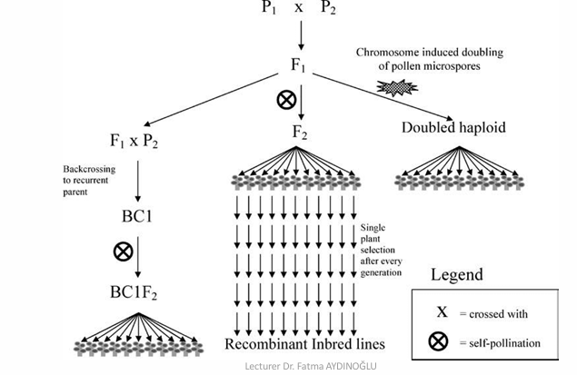

F2 and BC populations are considered to be temporary populations because they are highly heterozygous and cannot be propagated indefinitely through seeds. RILs, NILs and DHs are permanent populations because they are homozygous or ‘true-breeding’ lines that can be multiplied and reproduced without gene tic change occurring.

Maximum genetic information is obtained from F2 population using a codominant marker system. Dominant markers supply as much information as codominant markers in RIL, NILs and DHs because all loci are homozygous, or nearly so.

BC populations can be useful for mapping dominant markers if all loci in the recurrent parent are homozygous, and the donor and recurrent parent have contrasting polymorphic marker alleles Information obtained from BC populations using either codominant or dominant markers is less than that obtained from F2 populations because one, rather than two, recombinant gametes are sampled per plant. If the phenotypic variation is known to be controlled by QTLs which all exhibit complete dominance in the same direction, then a backcross to the recessive parent results in the QTL segregating in two classes and this cross is a more powerful means of locating QTLs than F2. F2 is more powerful for detecting QTLs of additive effect and can also be used to estimate the degree of dominance for detected QTLs. All of these information taken from [ResearchGate](https://www.researchgate.net/publication/228909274_Principles_requirements_and_prospects_of_genetic_mapping_in_plants)

### Identification of Polymorphism 

+  The second step in the construction of a linkage map is to identify DNA markers that reveal differences between parents

+ In general, cross pollinating species possess higher levels of DNA polymorphism compared to inbreeding species;mapping in inbreeding species generally requires the selection of parents that are distantly related. 

+ In many cases, parents that provide adequate polymorphism are selected on the basis of the level of genetic diversity between parents.

+ The choice of DNA markers used for mapping may depend on the availability of characterized markers or the appropriateness of particular markers for a particular species.

+ Once polymorphic markers have been identified, they must be screened across the entire mapping population, including the parents (and F1 hybrid, if possible) 

+ This is known as marker ‘genotyping’ of the population. 

+ Therefore, DNA must be extracted from each individual of the mapping population when DNA markers are used.

+ Significant deviations from expected ratios can be analyzed using chi-square tests. 

+ Generally, markers will segregate in a Mendelian fashion although distorted segregation ratios maybe encountered. 

+ In some polyploid species such as sugarcane, identifying polymorphic markers is more complicated.

+ The mapping of diploid relatives of polyploid species can be of great benefit in developing maps for polyploid species. 

+ However, diploid relatives do not exist for all polyploid species.

+ A general method for the mapping of polyploid species is based on the use of single-dose restriction fragments.

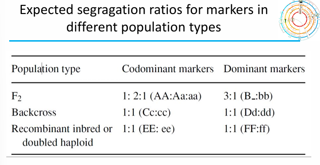

### Linkage Analysis of Markers

+ Although linkage analysis can be performed manually for a few markers, it is not feasible to manually analyze and determine linkages between large numbers of markers that are used to construct maps; compute rprograms are required for this purpose.

+ Linkage between markers is usually calculated using odds ratios (i.e. the ratio of linkage versus no linkage).

+ This ratio is more conveniently expressed as the logarithm of the ratio and is called a logarithm of odds (LOD) value or LOD score. 

+ LOD values of >3 are typically used to construct linkage maps

+ A LOD value of 3 between two markers indicates that linkage is 1000 times more likely (i.e. 1000:1) than no linkage (null hypothesis) [log10(1000)=3] 

+ LOD values may be lowered in order to detect a greater level of linkage or to place additional markers within maps constructed at higher LOD values.

+ Commonly used software programs include Mapmaker/EXP and MapManager QTX, which are freely available from the internet.

+ Join Map is another commonly-used program for constructing linkage maps.

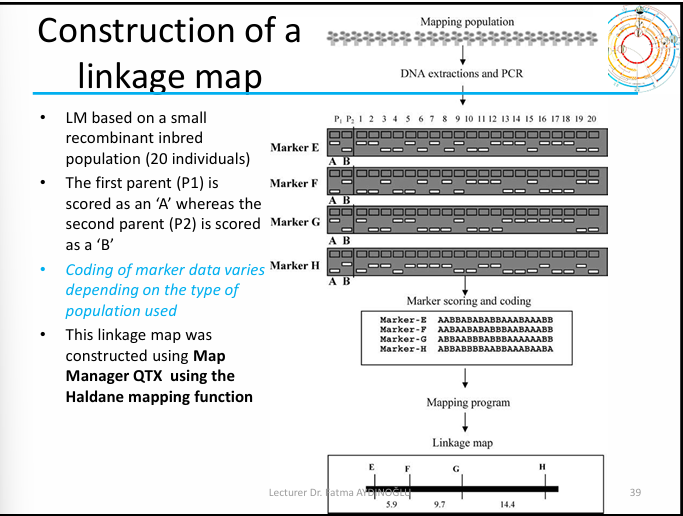

### A typical output of a linkage map

+ A difficulty associated with obtaining an equal number of linkage groups and chromosomes is that the polymorphic markers detected are not necessarily evenly distributed over the chromosome, but clustered in some regions and absent in others.

+  In addition to the non-random distribution of markers, the frequency of recombination is not equal along chromosomes.

+ The accuracy of measuring the genetic distance and determining marker order is directly related to the number of individuals studied in the mapping population.

+ Ideally, mapping populations should consist of minimum of 50 individuals for constructing linkage maps.

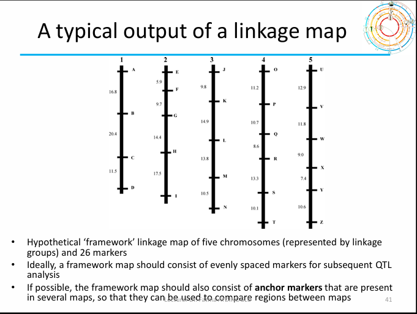

### Genetic Distance andMapping Functions

+ The greater the distance between markers, the greater the chance of recombinaiton occuring during meiosis. 

+ Distance along a linkage map is measured in terms of the frequency of recombination between genetic. 

+ Mapping functions are required to convert recombination frequency and the frequency of crossing over are not lineraly related. 

+ When map distances are small (<10 cM), the map distance equals the recombination frequency.

+ However, this relationship does not apply for map distances that are greater than 10CM. 

+ Two commonly used mappingfunctions are the Kosambi mapping function, which assumes 
that recombination events influence the occurrence of adjacent recombination events, and 
the Haldane mapping function, which assumes no interference between crossover events.

+ **It should be noted that distance on a linkage map is not directly related to the physical distance of DNA between genetic markers, but depends on the genome size of the plant species.**

+ Furthermore, the relationship between genetic and physical distance varies along a chromosome. 

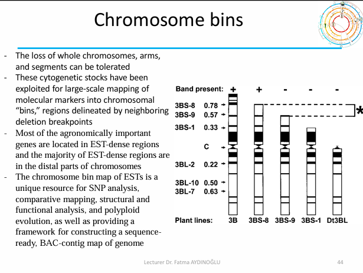


More information in [opengenetics.pressbooks](https://opengenetics.pressbooks.tru.ca/chapter/genetic-mapping/) page. 

# Lecture 7

## Molecular Dissection of Complex Traits

+  Before any planning can be done it is necessary to know as much as possible about the genetical control of the traits to be improved. Important knowledge is:

  + Is the trait inherited

  + How much of the phenotypic variation is explained **by genetic factore** and how much **by the environment?**

  + What is the nature of genetic variation?

  + How is the genetic variation organised?

+ The total phenotypic variance (Vp) can be partioned into genetic (Vg) and environmental variance (Ve) → ***Vg = Va + Vd + Vad***

+ From this informaiton:

  + it is possible to estimate the heritability of the trait and predict the response of the trait to selection
  
  + It is possible to estimate the number of genes which control the trait.

 ## Genic Control of Variability:

+ Some traits such as incompatibility, some disease resistances are controlled by one or two genes with big effects (monogenic traits)  
  
  + Differences in expression are 'qualitative'

+ Most traits such as growth or yield are complex, being under the control of a number of genes as well as the enivronment (polygenic trait)

  + Differences in expression are 2quantitative'

## Qualitative and Quantitative Traits

### Qualitative Trait:

Environment can play a role, complicating the interpretation of the results:

+ If we want to find DNA-markers that can help us to predict phenotype, we are only searching for one genetic locus. There exist standard experimental approches for this (e.g linkge map construction, bulk segregant analysis)

### Quantitative Trait:

There are many genotypes and there are no clear phenotypic differences among them.

+ If we want to find DNA markers that can help us to predict this phenotype, we are searching for several genetic loci simultaneously

+ There exist standard experimental approches for this (e.g QTL analysis)

+ This leads to many difficulties:

  + Many different genotypes can display the same phenotype.

  + 3 genes each with small equal effect on the phenotype

  + Each gene has two co-dominant alleles

  + 27 genotypes are possible, but we only see 7 phenotype. 

  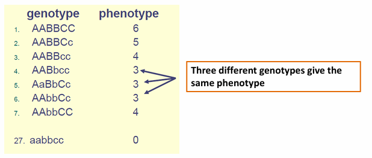

  + Epistasis: The effect of the genotype at one locus may depend on the genotype at another locus (non-allelic interaction)

  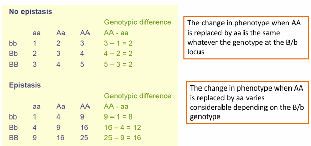

## Analysis of Phenotypic Data


