# LECTURE 1

## Definition of the Plant breeding:

Plant breeding as a human endeavor **(çaba, uğraş, gayret)** has its origins in antiquity, starting off simply as discrimination among plant types to select and retain plants with the most desirable features. 

**<u> NOTE </u>** Plant breeding can broadly be defined as the improvement of the genetic patterns of domestic plant populations. Based on the importance of plants for human life, humans have been involved in manipulating and improving plants for their needs for more than 11 000 years.

## Aim of Plant Breeding:

+ Plant breeders have mainly been concerned with bringing about a continuous improvement in the productivity of that part of the plant which is of economic importance, the stability of production through in-built resistance to pests and diseases and nutritive and organoleptic or other desired quality characters.

+ Plants breeding aims to improve the characteristics of plants so that they become more desirable agronomically (tarımsal açıdan) and economically. 

**<u> NOTE </u>** In summary the aim of plant breeding is to produce disease-free, high-yielding, and early-maturing varieties of crops.

## Objective of plant breeding: 

+ **High primary productivity and efficient final production for each unit of cultivation and solar energy invested:** to ensure that all the light that falls on a fields is intercepted by lraves and that photosynthesis itself is as efficient as possible.

  + Greater efficiency in photosynthesis could perhaps be achieved by reducing photorespiration. 

+ **High crop yield:** Plants must be selected which invest a large proportion of their total primary productivity into those areas which are commercially desirable, e.g. seeds, roots,leaves or stems, grain (tahıl, granül), fodder, fibre,tuber, cane or oil depending upon the crop species. 

+ **Desirable nutritional value, organoleptic properties and processing qualities:** the proportion of essential amino acids and the total protein in cereal grains, for example, should be increased to improve their nutritional quality. 

+ **Biofortifying crops:** with essential mineral elements that are frequently lacking in the human diet such as Fe and Zn, vitamins and amino acids. 

+ **Modifying crop plants to generate plant derived pharmaceuticals** to supply low-cos grugs and vaccines to the developing world. 

+ **More extensive and efficient nitrogen fixation:** breeding cereals that encourage (teşvik etmek) the growth of increased numbers of nutrogen fixing microorganisms around their roots to reduce the need for nitrogen fertilizer. 

+ **More efficient use of water:** whether there is a plentiful supply or dearth of water.

+ **Insensitivity to photoperiod and temperature:** selection of the crop cultivars that are insensitive to photoperiod of temperature and characterized by a high per-day biomass production would allow the development of contingency cropping patterns to suit different weather probabilities. 

+ **Plant arcitecture and adaptability to mechanized farming:** The number and positioning of the leaves, branching pattern of the stem, the height of the plant, and the positioning of the organs to be harvested are all important to crop production and often determine how well plants can be harvested mechanically. 
+ **Elimination of toxic compounds:** it is essential to develop varieties free from toxic compounds in some crops to make them safe for human consumption. 

+ **The following items are also included in this topic:**

```markdown
= Biomass and renewable energy
= imporoved quality
= Abiotic and Biotic resistance
= Dormancy 
= Desirable Agronomic Characteristics
= Synchronous Maturity
= Change in maturity Duration.
```

<p align="center">  </p>

## Undesirable Effects

+ **Reduction in Diversity:** Modern improved varieties are more uniform than land races. Thus plant breeding leads to reduction in diversity. The uniform varieties are more prone to the new races of pathogen than land races which have high genetic diversity. 

+ **Narrow genetic base:** Uniform varieties have narrow genetic base. such varieties generally have poor adapability. 

+ **Danger of Uniformity:** Most of the improved varieties have some common parents in the pedigree which may cause danger of uniformity. 

+ **Undesirable Combinaitons:** Sometimes, plant breedings leads to undesirable combinaitons. The examples of man made crops having undesirable combinaiton of characters are *Raphanobrassice* and *Pomato*. 

## Molecular Plant Breeding

+ Plant breeders will be equipped with innovative approaches;

  + to identify/or create genetic variaiton,
  + to define the genetic feature of the genes related to the variations (position,function and relationship with other genes and environments), 
  + to understand the structure of breeding populations, 
  + to recombine novel alleles or allele combinaitons into specific cultivars or hybrids, 
  + to select the best individuals with desirable genetic features which enable them to adapt to a wide range of environments. 

+ DNA chips and other technologies are being developed to study the expression of multiple or even all genes simultaneously. 

+ With the advent of DN-based molecular markers, the extensive genetic mapping od chromosome become readily possible for a variety of species.

+ Several mechanisms for the de novo variation have been described, including intragenic recombianiton, unequal crossing over among repeated elements, transposon activity, DN Amethylation, and paramutation.

+ Another important feature in plant breeding whose molecular basis is not understood is `heterosis` although it is used as the basis for many seed-producing industries. 

+ `Genomics` and prticularly `transcriptomics` are now being used to identify the heterotic genes responsible for increasing crop yields (microarray and real time PCR)

+ **Genetic modification of crops** today involves the interfacing of molecular biology, cell and tissue culture, and genetics/breeding

  + The transfer of genes by cellular and molecular means will increase the available gene pool and lead to second generation biotechnology plant products such as those with a modified oil, protein, vitamin, or micronutrient content or those that have been engineered to produce compounds that can be used as vaccines or anticarcinogens. 

<p align="center">

</p>

## Duration and cost of plant breeding programs

+ It is estimated that i takes about 7-10 years (or even longer) to complete a breeding program for annual cultivars as corn, wheat, and soybeans, and much longer for tree crops. 

+ The use of molecular techniques to facilitate the section process may reduce the time for plant breeding in some cases. 

+ Genetically engineered parental stock attracts a steep fee to use beacuse of the costs involved in their creation. 

## Selected milenstones in plant breeding

+ **9000 BC:** First evidence of plant domestication in the hills above the tigris river

+ **3000 BC:** Domestication of all important food crops in the old world completed. 

+ **1000 BC:** Domesticaiton of all important food crops in the New World completed. 

+ **700 BC:** Assyrians and Babyloninas hand pollinate date palms.

+ **1719:** Fairchild created first artifical hybrid (carnationx sweet william)

+ **1934:** Dustin discovered `colchicines`

+ **1950:** McClintock discovered the Ac-Ds system of transposable elements. 

+ **1972:** Berg, Cohen, and boyer introduced the `recombinant DNA` technology. 

+ **1994:** `"FlavrSavr" tomato` developed as `first genetically modified food` produced for the market.

+ **1995:** Bt corn developed. 

<u> <p style="color:gold;">NOTE:</p> 

Bt corn is enhanced through biotechnology to protect against insect pests. Its built-in insect protection comes from a naturally occurring microorganism called Bacillus thuringiensis or “Bt.” The protein produced by Bt corn selectively targets caterpillars within the order of Lepidoptera. </u>

+ **1996-1997:** `Roundup Ready` soybean and wheat introduced

## Early Efforts at plant breeding

+ __Selective breeding;__ has been employed by early farmers to re-engineer plants to produce traits or qualities that were considered to be desirable to consumers. 
  + the best plants to provide seed for their next crop

  + Fİnd prolific or disease resisted plant and capture these desirable traits by corresponding them into other plants. 

+ __Domestication;__ modern plant breeding started with sedentary agriculture and the of domesticaiton the first agricultural plants, cereals.

+ __Artifical crosses;__ besides selecting plants with useful characteristic s breeders also arrange 'marriages' between plants with different traits in the hope of producing fertile offspring carrying both traits. 

+ __Hybridization;__ to be the important sources of new cultivars and stressed crossing of carefully selected parents to meet the aims of new cultivars. 

<p align="center">
 
</p>

## Doemsticaiton of the plant breeding

+ The process of bringing a wild species under human management is referred to as `domenstication`

  + The earliest records indicate that agriculture developed some 11,000 ears ago in the so-called *Fertile Crescent*.

+ Domesticaiton is a selection process carried out by man to adapt plants and animals to their own needs, wheteher as farmers or consumers. 

+ <u> Domestication is directed evolution; as a result, the process of evolution is accelerated. </u>

+ The key to domesticaiton is the selective advantage of rare mutant alleles
 which are desirable for saccesful cultivaiton but unnecessary for survival in the wild. 

<p align="center">

</p>

### Steps in the domestication process

+ Man not only planted seeds, but also:

  + `moved seeds from their native habitat` and planted them in areas to which the were perhaps not as well adapted. 

  + `Removed certain natural selection pressures by growing the plants` in a cultivated field. 

  + `applied artifical selection pressures` by choosing characteristics that would not necessarily have been benefical for the palnts under natural conditions. 

## Genetic engineering and gene transfer

+ The discovery of the structure of DNA has enhanced traditional breeding techniques by allowing breeders to pinpoint the particular gene responsible for a particular trait and to follow its transmission to subsequent generations. 

+ Enzymes that cut and rejoin DNA molecules allow scientists to manipulate genes in the laboratory. 

+ The goal of plant genetic engineers is to isolate one or more specific genes and introduce these into plants. 

+ DNA can also be introduced into cells by bombardment with DNA-coated particles or by `electroporation`.


<p align="center">
 
</p>

## DNa markers and genomics

+ During the 1980s and 1990s, various types of molecular markers such as `restriction fragment length polymorphism (RFLP)`, `Randomly amplified polymorphic DNA (RAPD)`, `microsatellites` and `Single nucleotide polymorphism (SNP)` were developed. 

+ Becuase of their abundance and importance in the plant genome, molecular markers have been widely used in the fields of germplasm evaluation, genetic mapping, map-based gene discovery and marker-assisted palnt breeding

+ Technological developments in bioinformatics, genomics and various omics fields are creating substantial data on which future revolutions in plant breeding can be based

## Base of plant breeding

+ Darwin's theory of evolution through natural selection can be summed up in three principles that are at the core of plant breeding. These are the principles of:

  + **`variation`:** Variation in morphology, physiology, and behavior exist among individals in a natural population. 

    + There are various sources of genetic variation:

      + crossover, genetic drift and gene flow
      + Mutation (loss, addition, duplicaiton or rearrangement of whole chromosomes or chromosome segments)

  + **`Heredity`:** Offspring resemble their parents more than they resemble unrelated individuals.

  + **`Selection`:** Some individuals in a group are more capable of surviving and reproducing than others. 

<u> <p style="color: orange;">Recall</p>

<p style="color:yellow;">Genetic drift</p> is an evolutionary change in allelic frequencies of a population as a matter of chance. It occurs in very small populations, but its effects are strong. It occurs due to an error in selecting the alleles for the next generation from the gene pool of the current generation. It does not occur due to any environmental influences.

In large populations, the allele frequency of the genes remains relatively stable because the genes are not affecting fitness and do not have a natural selection pressure against the alleles. 

<p style="color:yellow;">The gene flow</p> is a popular and individual genetic material which transfers from one population to another. This involves different types of events such as pollen being driven to an entirely new destination or people migrating to a new place. If the versions of gene flow are carried to a population where the gene versions do not exist, it can be a major source of genetic variation. In the above image, the version of brown colouration shifts from one population to another.

Migration from one popular place to another is also responsible for a change in allele frequencies which covers a proportion of members to carry a particular variant of a gene. This immigration can also result in the addition of genetic variants to the established gene supply of one particular population. </u>

## Principles of breeding

+ **Inbreeding:** main goals of the inbreeding;

  + Increase the homozygosity at all or specific loci in the plant genome

  + produce a plant which breeds true

  + produce uniform plants

<p align="center"> 

</p>

+ **Hybridization:** Hybridization occurs when inbreed parents are mated (cross pollinated)

  + creates heterozygous individual

  + increased heterosis (vigor) in F1 generation. 

<p align="center"> 

</p>

+ **Heterois (hybrid Vigor)** Heterosis occurs when two homozygous individuals are cross pollinated
  + This causes all loci to become heterozygous
  
  + The increased heterozygosity causes increased plant vigor

  + Benefits of Increased Vigor
  
    + Increased yield
    
    + Better standability
    
    + Better germination
    
    + Overall better plant performance

  <p align="center">
  
  </p>

# LECTURE 2

## Mendelian Genetics

+ Mendel developed two important laws of genetics

  + Law of segregation 

  + Law of independent assortment

### Law of Segregation

The Principle of Segregation describes `how pairs of gene variants are separated into reproductive cells.` The segregation of gene variants, called alleles, and their corresponding traits was first observed by Gregor Mendel in 1865. Mendel was studying genetics by performing mating crosses in pea plants. He crossed two heterozygous pea plants, which means that each plant had two different alleles at a particular genetic position. He discovered that the traits in the offspring of his crosses did not always match the traits in the parental plants. This meant that the pair of alleles encoding the traits in each parental plant had separated or segregated from one another during the formation of the reproductive cells. From his data, Mendel formulated the Principle of Segregation. We now know that the segregation of genes occurs during meiosis in eukaryotes, which is a process that produces reproductive cells called gametes. `(This text is taken from [nature](https://www.nature.com/scitable/definition/principle-of-segregation-301/) page.)`

<p align="center">

</p>


### Law of Independent Assortment

The Principle of Independent Assortment describes how different genes independently separate from one another when reproductive cells develop. 

We now know that this independent assortment of genes occurs during meiosis in eukaryotes. During meiosis, the pairs of homologous chromosome are divided in half to form haploid cells, and this separation, or assortment, of homologous chromosomes is random. This means that all of the maternal chromosomes will not be separated into one cell, while the all paternal chromosomes are separated into another. Instead, after meiosis occurs, each haploid cell contains a mixture of genes from the organism's mother and father.

Another feature of of independent assortment is recombination. Recombination occurs during meiosis and is a process that breaks and recombines pieces of DNA to produce new combinations of genes. Recombination scrambles pieces of maternal and paternal genes, which ensures that genes assort independently from one another. It is important to note that there is an exception to the law of independent assortment for genes that are located very close to one another on the same chromosome because of genetic linkage `(This text is taken from [nature](https://www.nature.com/scitable/definition/principle-of-independent-assortment-302/) page.)`

<p align="center">

</p>

+ Consider the dihybrid cross between YyRr heterozygotes

+ For a monohybrid cross Yy plants, we can use a simple `punnet square` to determine that the probabilities of the offspring genotypes are 1/4 for YY, 1/2 for Yy, and 1/4 for yy.

+ the same probabilities apply to the offspring genotypes for seed shape: 1/4 RR, 1/2 Rr, and 1/4 rr.

+ We can simply use the multiplication rule to determine the probability of each of the genotypes in the F2 generation. 

+ The calculations for finding the probabilities of two of the possible F2 genotypes (YYRR and YyRR) are shown below 

```markdown
Probability of YYRR= 1/4 (probability of YY) x 1/4 (RR)= 1/16
```

```markdown
Probability of YyRR= 1/2 (Yy) x 1/4 (RR)= 1/8
```

+ A trihybrid with purple flowers and yellow, row seeds (heterozygous for all three genes) with a plant with purple flowers and green, wrinkled seeds (heterozygous for flower color but homozygous recessive for the other two characters)

+ Using Mendelian symbols, our cross is PpYyRr Ppyyrr.

+ Listing all genotypes we could get that fulfill this condition: ppyyRr, ppYyrr, Ppyyrr, PPyyrr, and ppyyrr

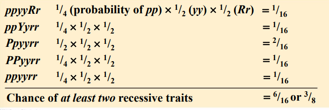

## Basic Plant Genetic

In eukaryotes, the DNA of the genome typically contains large fraction that does not carry genes

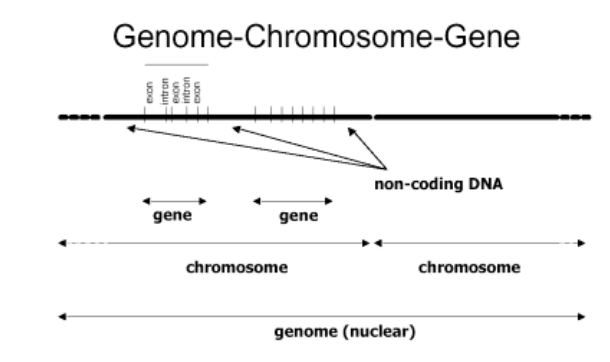

<u> A TYPİCAL EUKARYOTİC GENE </u>

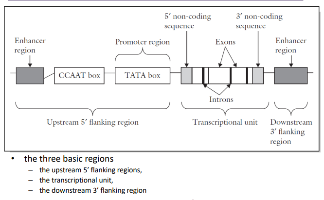

***<u><p style="color:yellow;">EUKARYOTİC TRANSCRİPTİON GENE REGULATİON</p></u>***

<p style="color:green;">
Like prokaryotic cells, the transcription of genes in eukaryotes requires the action of an RNA polymerase to bind to a DNA sequence upstream of a gene in order to initiate transcription. However, unlike prokaryotic cells, the eukaryotic RNA polymerase requires other proteins, or transcription factors, to facilitate transcription initiation. RNA polymerase by itself cannot initiate transcription in eukaryotic cells. </p>

***<u><p style="color:brown;">Promoter and the Transcription Machinery</p></u>***

<p style="color:green;">
Genes are organized to make the control of gene expression easier. The promoter region is immediately upstream of the coding sequence. This region can be short (only a few nucleotides in length) or quite long (hundreds of nucleotides long). The longer the promoter, the more available space for proteins to bind. This also adds more control to the transcription process. The length of the promoter is gene-specific and can differ dramatically between genes. Consequently, the level of control of gene expression can also differ quite dramatically between genes. The purpose of the promoter is to bind transcription factors that control the initiation of transcription. 
</p>

<p style="color:green;">
Within the core promoter region, 25 to 35 bases upstream of the transcriptional start site, resides the TATA box. The TATA box has the consensus sequence of 5’-TATAAA-3’. The TATA box is the binding site for a protein complex called TFIID, which contains a TATA-binding protein. Binding of TFIID recruits other transcription factors, including TFIIB, TFIIE, TFIIF, and TFIIH. Some of these transcription factors help to bind the RNA polymerase to the promoter, and others help to activate the transcription initiation complex. 
</p>

<p style="color:orange;">
In some eukaryotic genes, there are regions that help increase or enhance transcription. These regions, called enhancers, are not necessarily close to the genes they enhance. They can be located upstream of a gene, within the coding region of the gene, downstream of a gene, or may be thousands of nucleotides away.
Enhancer regions are binding sequences, or sites, for specific transcription factors. When a protein transcription factor binds to its enhancer sequence, the shape of the protein changes, allowing it to interact with proteins at the promoter site. However, since the enhancer region may be distant from the promoter, the DNA must bend to allow the proteins at the two sites to come into contact. DNA bending proteins help to bend the DNA and bring the enhancer and promoter regions together.
</p>

<p align="center">


<u> A TYPİCAL EUKARYOTİC MATURE mRNA </u>

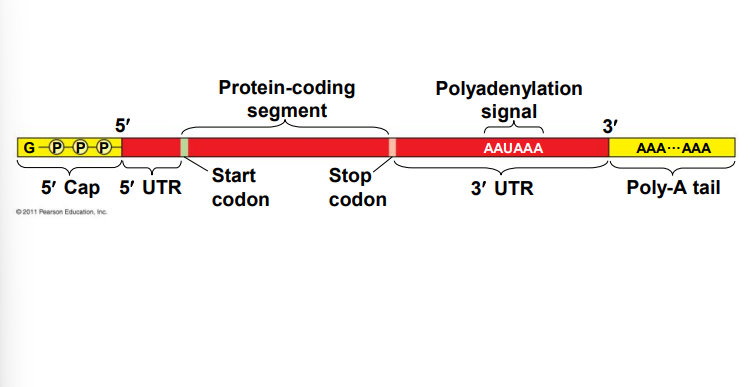

`Allele` is one of a number of alternative forms of the same gene or same genetic locus.

`Locus` is the specific location of a gene or DNA sequence od position on a chromosome

## Inheritance Patterns are Often More Complex Than Predicted by Simple Mendelian Genetics

+ Many heritable characters are not determined by only one gnee with two alleles

+ Most genes have multiple phenotypic effects, a property called `pleiotropy`.

+ However the basic principles of segregation and independent assortment apply even to more complex patterns of inheritance

## Dominance/ Recessiveness/ Codominant/ Complete Dominance/ Incomplete Dominance

There are two alleles for any given gene; dominant and recessive 

+ `Dominance` is a relationship between alleles; one allele can be dominant over a second allele, recessive to a third alelle, and codominant to a fourth (dominance differs from epistasis)

+ `Co-dominance` occurs when the contributions of both alelles are visible in the phenotype

  + For example in co-dominance, a red homozygous flower will produce offspring that have red and white spots. 

+ `Complete Dominmance` is the effect of one allele in a heterozygous genotype completely masks the effects of the other. 

+ `Incomplete and Semi-dominance` occurs when the phenotype of the heterozygous genotype is distinct from and often intermediate to the phenotypes of the homozygous genotypes. 

<p align="center">

</p>

## The Relation Between Dominance and Phenotype

+ a dominant allele does not subdue a recessive alelle; alleles do not interact that way

+ Alleles are simply variations in a gene's nucleotide sequence 

+ For any character, dominance/recessivenes relationshio of alelles depend on the level at which we examine the phenotype

+ Supposed that a dysfunctional enzyme causes an accumualtion of lipids

  + at the organismal level, the alelle is recessive

  + At the biochemical level, the phenotype is incompletely dominant

  + At the molecular level, the alelles are codominant

## Epistasis

Some traits may be determined by two or more genes

+ In epistasis, a gene at one locus alters the phenotypic expression of a gene at a second locus

+ Absence of expected phenotype as a result of masking expression of one gene pair by the expression of another gene pair

  + The `homozygous recessive conditions` masks the effect of a `dominant allele at another locus`

  + Crossing sweet pea plants produces purple; F2 generation hs a 9:7 rather than 9:3:3:1 dihybrid ratio; explained by `homozygous recessive blocking production of a metabolic enzyme`

  + Albino animals inherit allelic pair (aa) preventing production of melanin, expression of eye, hair,color.

  <p align="center">
   
  </p>

## Polyploidy

+ Arise by failure mitosis or meiois

+ Polyploid human zygotes are not viable

+ `Many polyploids are infertile, depending on the number of chromosome sets they have inherited. If the individual has inherited an odd number of chromosome sets (3n, 5n, etc), they are usually infertile. This is because the chromosomes cannot pair up correctly during meiosis and thus mo functional gametes are produced. If the individual has an even number of chromosome sets, they are usually fertile. This is because the chromosomes can still pair up during meiosis and produce functional gametes.`

+ `This explains why most naturaslly occuring polyploids have an even number of chromosome sets. It also explains why most organisms with an odd number of chromosomes are palnts. This is because plants can undergo vegetative growth, resulting in numerous individuals without producing gametes or the need for meiosis.`

+ ***`Polyploid:`*** having more complete sets of cromosomes than an ancestor triploid (3n), tetraploid (4n), hexaploid (6n), octaploid (8n)

+ ***`Euploid:`*** having the normal number of complete sets of chromosomes for plants and animals, usually 2 sets (diploid, 2n); for gametes, 1 set (haploid, n).

+ ***`ANeuploid:`*** having an incomplete or overcomplete sets of chromosomes.

  + ***Nullisomy:*** entire homologous pair is missing 

  + ***Monosomy:*** One homolog; partner is missing (2n-1)

  + ***Polysomy:*** More than two homologs

    + Trisomy (2n+1)

    + Tetrasomy

    + Pentsomy

### Polyploid can Arise by an Error in Mitosis

+ Through the applicaiton of appropriate chemicals and other suitable environmental conditions, plant cells can be made to proliferate into an amorphous mass called `callus`

+ `Callus is an undifferentatied mass of cells` (cells with no assigned functions); it is a material used in genetic engineering to receive and incorporate foreign DNA into cells. 

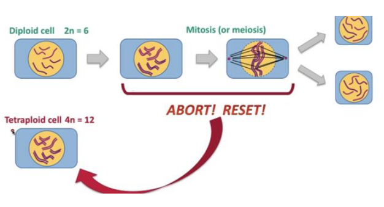


## Mitotic Failure is Often induced with colchicine

+ The nuclear division process may be disrupted (e.g., Using a chemical called colchicine) on purpose by scientist, by interfering with the `spindle fibers` (the structures that pull the chromosome to opposite poles of the cell)

+ The consequence of this action is that the chromosomes fail to seperate properly into the daughter cells. 

+ A mitotic product may contain a duplication of all or some of the original set of chromosomes

<p align="center">

</p>

+ Tetraploidization can restore fertility to an infertile diploid hybrid plants. 

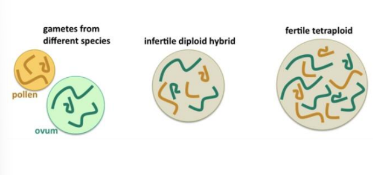

### Triploidy can arise by an error in meiosis 1

During meiosis I, homologous chromosomes fail to separate properly, leading to the formation of gametes with an extra set of chromosomes. When such gametes are fertilized by a normal gamete, a triploid zygote is formed.

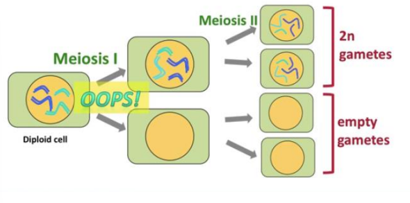

### Triploidy can arise by an error in meiosis 2

Meiosis II involves the separation of sister chromatids, and errors during this stage generally result in a gain or loss of individual chromosomes (aneuploidy), rather than a complete extra set of chromosomes (triploidy).

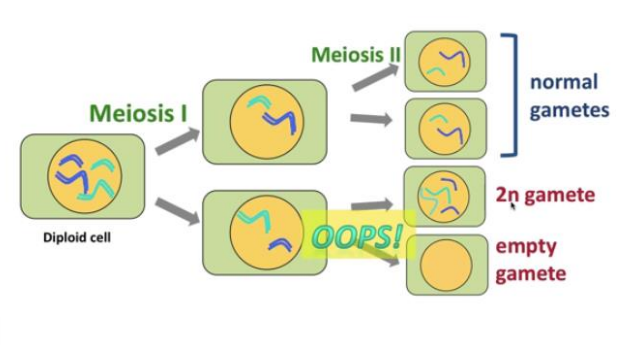

### Triploidy can arise by double fertilization

Triploidy typically arises from the fusion of two sperm with one egg (dispermy) or from the fertilization of an egg by a diploid sperm (haploid-diploid). Both scenarios involve fertilization errors during reproduction rather than the normal process of double fertilization, which involves one sperm fertilizing one egg to form a diploid zygote in plants. Double fertilization is a unique process found in flowering plants where one sperm fertilizes the egg to form the zygote, and the other sperm fertilizes the central cell to form the endosperm, which provides nourishment to the developing embryo. Triploidy resulting from double fertilization is not a typical occurrence in biological systems.

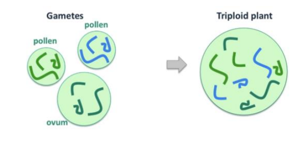

### Triploidy can arise by mating of a tetraploid to a diploid

Triploidy can indeed arise through the mating of a tetraploid individual (with four sets of chromosomes) with a diploid individual (with two sets of chromosomes). When gametes from the tetraploid combine with gametes from the diploid during fertilization, the resulting zygote may inherit an extra set of chromosomes, resulting in triploidy.

This scenario is an example of a form of polyploidy, where an organism has more than two complete sets of chromosomes. Triploidy, in this case, arises from the combination of gametes from individuals with different ploidy levels.

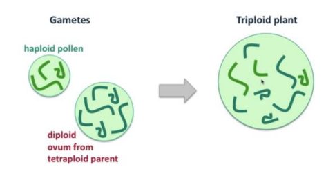

### In triploid meiosis chromosomes are unpaired or mispaired

In triploid individuals, during meiosis, chromosomes may indeed experience pairing abnormalities. This can occur because there is an uneven number of chromosomes, making it impossible for all chromosomes to pair properly in sets of two, as occurs in normal diploid meiosis.

Because there are three sets of chromosomes in triploid individuals, there might be difficulty in forming proper chromosome pairs during prophase I of meiosis. Chromosomes may either remain unpaired, leading to univalents, or they may mispair with chromosomes from different sets, forming trivalents. These pairing abnormalities can result in errors during segregation, leading to gametes with unbalanced chromosome numbers.

The irregularities in chromosome pairing and segregation during meiosis in triploid individuals can contribute to reduced fertility and various developmental abnormalities in the resulting offspring.

## Autopolyploidy

+ Autopolyploidy results from a failure of the chromosomes to seperate during meiosis. However, unlike aneuploidy, not just a single pair of chromosomes failure to seperate, all of them fail to seperate. This total non-disjunction of all chromosomes results in gametes carrying two sets of chromosomes (2n) 

+ When one of the resulting gametes (2n) combines with a regular haploid (n) gamete, the resulting offspring are triploid (3n).

+ Offspring produced in this way are normally infertile because they have an uneven number of chromosomes that won't pair correctly during meiosis. 

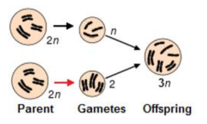

+ When two of these gametes (2n) combine, the resulting offspring are tetraploid (4n). This is common in plants as they produce both male and female gametes and are often capable of self-fertilisation. 

+ The resulting offspring a generally fertile as they have an number of chromosomes. If the new tetraploid offspring cannot reproduce with the parental type (diploid) plants, but can repdoduce with each other, a new species has been fromed. 

<p align="center">

</p>

## Allopolyploidy

+ Allopolyploidy occurs when two closely related species mate and produce a hybrid containing chromosome sets from both parent species. 

+ The resulting hybrid is usually sterile because the chromosomes from each species cannot pair correctly during meiosis. The two different species involved may also contribute different numbers of chromosomes which again prevents chromosome pairing during meiosis, rendering the hybrid sterile. 

<p align="center">

</p>

## Amphipolyploidy

+ Doubling the chromosome number in a sterile hybrid can often produce a fertile hybrid. This process is known as amphipolyploidy.

+ Allopolyploidy generally produces infertile hybrids because the chromosomes from each of the parent species cannot pair correctly. In this example, you can almost think of the resulting hybrid as being haploid (n) with 5 individual chromosomes rather than any chromosome pairs. However, autopolyploidy can double the chromosome number, producing a fertile hybrids with two of each chromosome.

+ If these new fertile hybrids cannot reproduce with the parental types, but can reproduce with each other, a new species has been formed. 

<p align="center">

</p>

<p align="center">

</p>

## Evolutionary significance

+ Polyploidy can cause speciation (the formation of new species)

+ It has played an important role in the evolution of many species, especially plant crops. 

## The evolution of wheat

Each hybridisation was followed by chromosome doubling in the new hybrid; this enables normal bivalent formation at meiosis and thus the production of fertile plants. The initial hybridisation, that occurred approximately 10,000 years ago, is believed to have been between the two grass species T. urartu (the A genome donor), and T. speltoides (the B genome donor). This new species would have been tetraploid (four complete genome complements) Hexaploid wheat arose as a result of a second hybridisation between the new tetraploid and a third diploid species, T. tauschii (the D genome donor). Again, chromosome doubling must have occurred in order to produce a fertile individual. This new species would then have have 42 chromosomes; that is, six complete genomes each of 7 chromosomes (This information is taken from [cerealsdb.uk.net](https://www.cerealsdb.uk.net/cerealgenomics/WheatBP/Documents/DOC_Evolution.php) page.)

<p align="center">

</p>

## Qualitative and quantitative traits

+ `Qualitative traits` are genetically controlled by one or a few major genes, each of which has a relatively large effect on the phenotype but is relatively insensitive to environmental influences.

  + Trait distribution in a typical segregating population such as an F2 shows multi-peak distribution, although individuals within a category show continuous variation
  
  + Each individual in the population can be classified unambiguously into distinct categories that correspond to different genotypes so that they can be studied using Mendelian methods

+ Quantitative traits are genetically controlled by many genes, each of which has a relatively small effect on the phenotype, but is largely influenced by environmental factors

  + Trait distribution in an F2 population usually shows a normal or bell-shape distribution and as a result, individuals cannot be classified into phenotypic categories that correspond to different genotypes thus making the effects of individual genes indistinguishable

  + Quantitative genetics is traditionally described as the study of all these genes as a whole and the total variation observed in a population results from the combined effects of genetic (polygenes as a whole) and environmental factors
  
  + However, quantitative variation is not due solely to minor allelic variation in structural genes as regulatory genes no doubt also contribute to this variation
  
  + We expected polygenes to show allthe typical properties of chromosomal genes both in terms of action and in transmission through meiosis

## Polygenic Inheritance

+ Quantitative characters are those that vary in the population along a continuum

+ Quantitative variation usually indicates polygenic inheritance, an additive effect of two or more 
genes on a single phenotype

+ Grain colour in wheat where each gene promotes pigment
production is an example of polygenic inheritance

+ The effects of each gene are small where uppercase and lowercase letters did not imply dominance or recessiveness but rather the additive effects of each allele

<p align="center">
 
</p>

## Genetic Variation

+ The creation of new alelles and the mixing of alelles through recombinaiton give rise to `genetic variation` which is on eof the forces behind evolution.

+ Natural selection favours one phenotype over another and these phenotypes are conditioned by one or more alelles.

+ `Genetic variation is fundamental for selection, by which progress in plant breeding can be made`

+ There are various sources of genetic variation:

  + Crossover, genetic drift and gene flow

  + Mutation

## Mutation

+ A mutation is any change in the sequence of the DNA encoding a gene which leads to a change in the hereditary material when an organism undergoes DNA replication

+ During the process of replication, the nucleotides of a chromosome are altered, so rather than creating an identical copy of DNA strands, there are chemical variations in the replicated strands

+ The alteration on the chemical composition of DNA triggers a chain reaction in the genetic information of an individual

+ The effect of a mutation depends on its size, location (intron or exon etc.), and the type of cell in which the mutation occurs

+ Large changes involve the loss, addition, duplication or rearrangement of whole chromosomes or chromosome segments

+ Most DNA polymerases have the ability to proofread their work to ensure that the unaltered genetic material is transferred to the next generation

### Mutation Types

+ `Point Mutation:` represent the smallest changes where only a single base is altered

  + For example, a snigle nucleotide change may result in the change of an amino acid (aa) codon into a stop codon and thus produce a change in the phenotype. 

  + Point mutation do not usually benefit the organism as `most occur in recessive genes` and are not usually expressed unless two mutations occur at the same locus

+ `Synonymous or silent substitutions:` The sea sequence of the protein is not changed because several codons can code for the same aa, and in non-synonymous substitutions changes in the aa sequenc may not affect the function of the protein.

+ `Loss-of-function mutations:` Wild type alelles typically encode a product necessary for a specific biological function and if a mutation occurs in that alelle, the function for which it encodes is also lost. 

  + They are typically recessive

  + The degree to which the function is lost can vary

    + If the function is entirely lost, the mutation is called a `null mutation`

    + It is also possible that some function may remain, but not at the level of the wild-type alelle, these are known as `leaky muatations`

+ `Gain-of-function mutations:` 
a small number of mutations are actually benefical to an organism providing new or improved gene activity.

  + In these cases, the mutation creates a new alelle that is associated with a new function.

  + Any heterozygote containing the new alelle along with the original wild-type alelle will express the new alelle.

  + Genetically this will define the mutation as a dominant

+ `Substitution:` is a mutation in which one base is exchanged for another. Such a substitution could change:

  + a codon to one that encodes a different aa thus causing a small change in the protein produced
  
  + a codon to one that encodes the same aa resulting in no change in the protein produced
  
  + an aa-coding codon to a single ‘stop’ codon resulting in an incomplete protein

+ `Insertions/deletions (indels):` produce changes by deleting or inserting sections of DNA into the ‘parental’ DNA sequence

  + Because it is usually impossible to say whether a sequence has been deleted from one plant or inserted into another, these differences are called indels
  
  + Obviously the deletion of part of a gene can seriously affect the phenotype of organisms
  
  + Insertions can be disruptive if they insert themselves into the middle of genes or regulatory regions

`Frame-shift mutation:` A mutation in which one nucleotide is changed causing all the codons to its right to be altered

  + Since protein-coding DNA is divided into codons of three bases long, insertions and deletions of a single base can alter a gene so that its message is no longer correctly parsed
  
  + As a result, a single base change can have a dramatic effect on a polypeptide sequence

+ `Germinal mutations:` Mutations which occur in germ line cells including both the gametes and the cells from which they are formed

  + A single germ line mutation can have a range of effects:
  
    + no phenotypic change; mutations in junk DNA are passed on to the offspring but have no obvious effect on the phenotype; 
    
    + small (or quantitative) phenotypic changes
    
    + significant phenotypic change

+ `Somatic mutation:` Mutations in somatic cells which give rise to all non-germ line tissues, only affect the original individual and cannot be passed on to the progeny.
